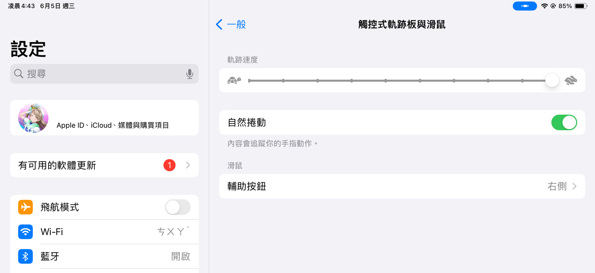

# 通識結果展示  
連接方式如同圖一  
  
  
## STM32F103C8T6 設置  
程式碼為[Project 6: 利用外部中斷回報 USB 滑鼠的操作](https://github.com/Weng20011103/GS4538_Group_Project/tree/main/STM32/Project/Project_6_EXTI_USB_Mouse_3#project-6-%E5%88%A9%E7%94%A8%E5%A4%96%E9%83%A8%E4%B8%AD%E6%96%B7%E5%9B%9E%E5%A0%B1-usb-%E6%BB%91%E9%BC%A0%E7%9A%84%E6%93%8D%E4%BD%9C)的內容  
  
在其`PB0`、`PB1`和`PB5`接受到下降沿的中斷後，會讀取`PA0`到`PA7`八個腳位的電壓。  
1. `PB0`控制水平位移  
2. `PB1`控制垂直位移  
3. `PB5`控制左鍵滑鼠點擊  
  
## iPad Air 4 設置  
在設定中觸控式軌跡板與滑鼠的軌跡速度要調到最高。  
  
  
> [!NOTE]
> 這個選項要插上滑鼠後才會顯示出來。  
  
## PYNQ Z2 設置  
將此 pynq 資料夾放到 PYNQ Z2 的 Jupyter Notebook 中，此部分包含腳本程式碼和圖片的素材，然後再運行`final_v3.ipynb`即可開始使用腳本功能  
  
> [!IMPORTANT]
> PYNQ Z2 的電源要足夠，不然配置 HDMI 會造成板子當掉。實測創見的 USB 3.0 集線器用連到 microB 孔供電可行。  