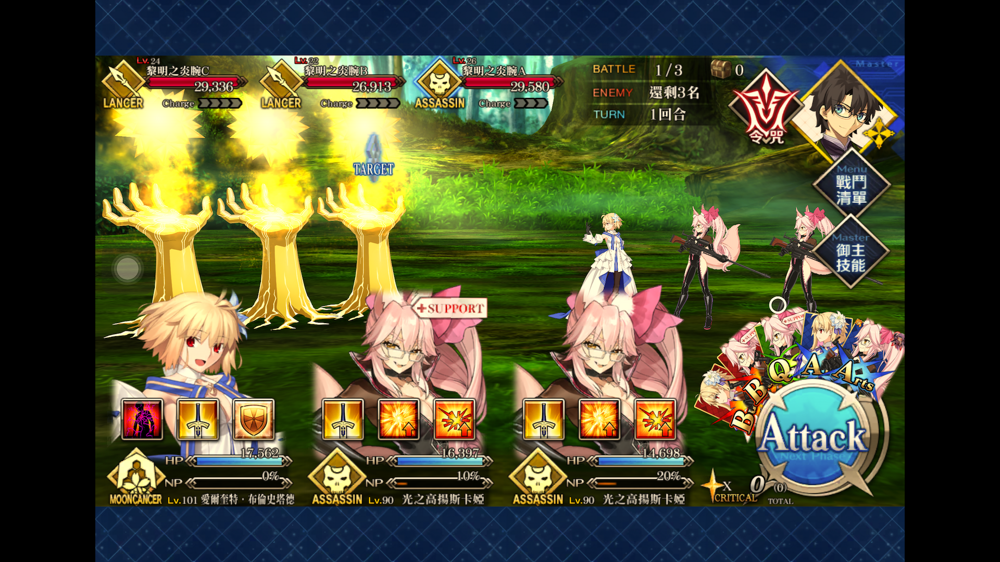
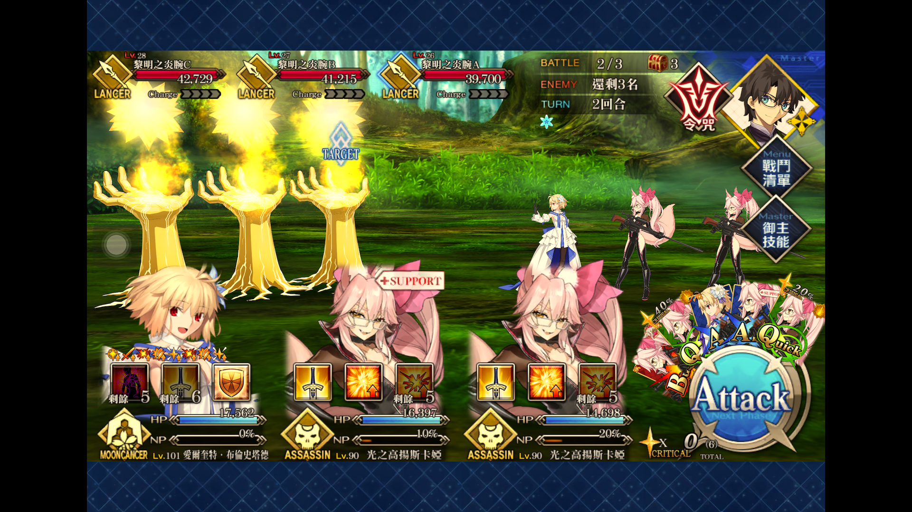
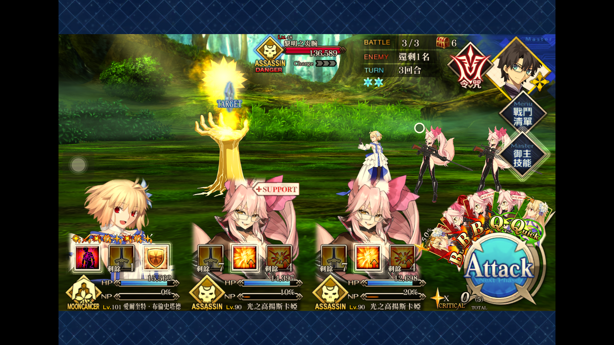
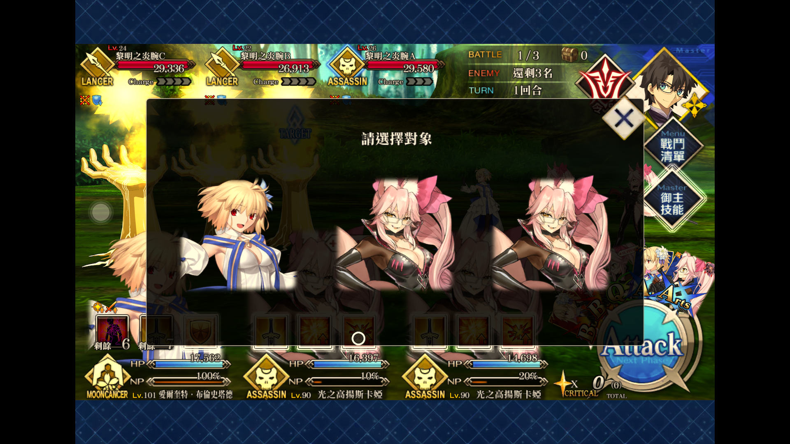
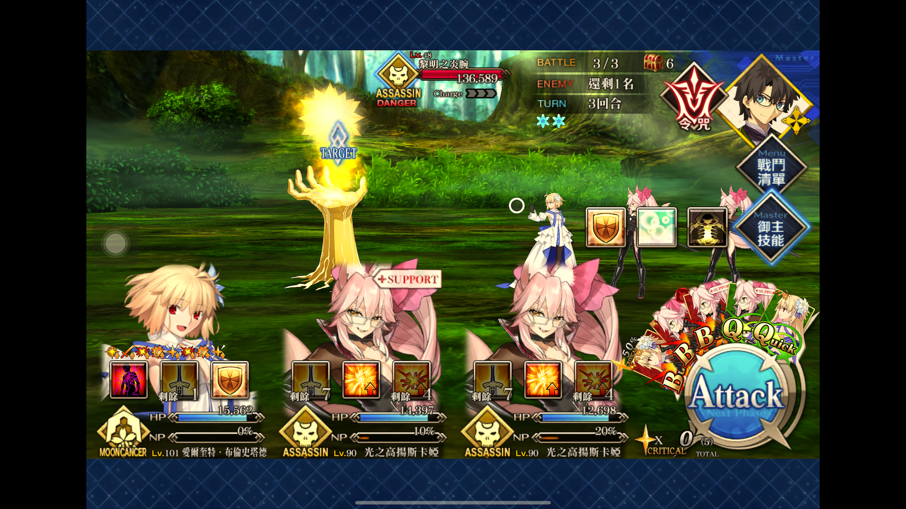
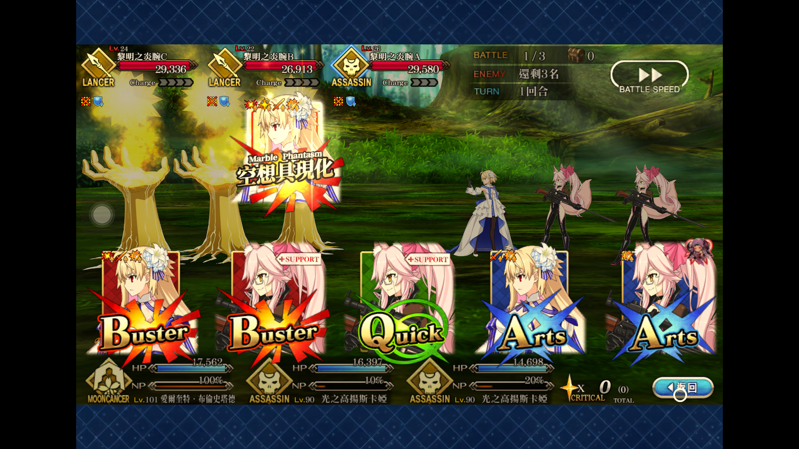

# FGO 腳本流程  
## 第一回合  
第一回合初始狀態:  

  
流程表格:  
|第幾次點擊|滑鼠操作|
|:---|:---|
|1|Archetype:Earth 技能一 虹の魔眼 A|
|2|技能加速|
|3|Archetype:Earth 技能二 星の息吹 C|
|4|技能加速|
|5|中間的光之高揚斯卡婭 技能三 ＮＦＦスペシャル A|
|6|技能選擇從者 Archetype:Earth|
|7|技能加速|
|8|右邊的光之高揚斯卡婭 技能三 ＮＦＦスペシャル A|
|9|技能選擇從者 Archetype:Earth|
|10|技能加速|
|11|Attack 按鍵|
|12|Archetype:Earth 寶具 空想具現化|
|13|指令卡任一張|
|14|指令卡任一張|
  
## 第二回合  
第二回合初始狀態:  

  
流程表格:  
|第幾次點擊|滑鼠操作|
|:---|:---|
|1|中間的光之高揚斯卡婭 技能一 イノベイター・バニー A|
|2|技能選擇從者 Archetype:Earth|
|3|技能加速|
|4|右邊的光之高揚斯卡婭 技能一 イノベイター・バニー A|
|5|技能選擇從者 Archetype:Earth|
|6|技能加速|
|7|Attack 按鍵|
|8|Archetype:Earth 寶具 空想具現化|
|9|指令卡任一張|
|10|指令卡任一張|
  
## 第三回合  
第三回合初始狀態:  

  
流程表格:  
|第幾次點擊|滑鼠操作|
|:---|:---|
|1|御主魔術禮裝 アトラス院制服|
|2|御主魔術禮裝 技能三 メジェドの眼|
|3|技能選擇從者 Archetype:Earth|
|4|技能加速|
|5|Archetype:Earth 技能一 虹の魔眼 A|
|6|技能加速|
|7|Archetype:Earth 技能二 星の息吹 C|
|8|技能加速|
|9|Attack 按鍵|
|10|Archetype:Earth 寶具 空想具現化|
|11|指令卡任一張|
|12|指令卡任一張|
  
## 技能選擇從者  

  
## 御主魔術禮裝技能  

  
## 選擇寶具和指令卡  
