# Lab 1: 安裝 Vivado 2022.1  
## Google 搜尋 Vivado 2022.1 點擊第一個網站  
[Downloads](https://www.xilinx.com/support/download.html)  
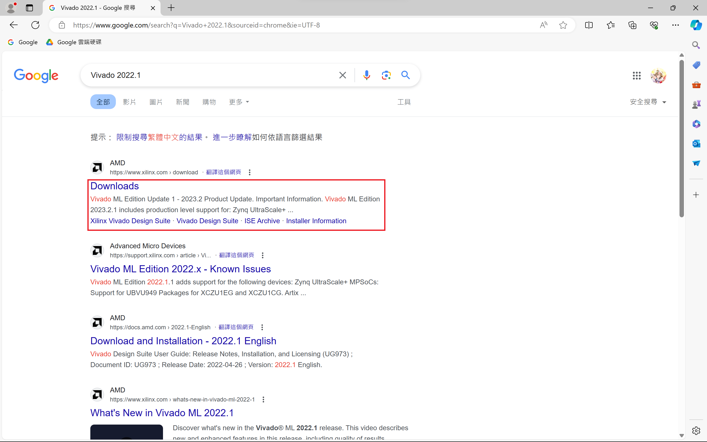
  
## 點擊 Vivado Archive 後再點擊 2022.1  
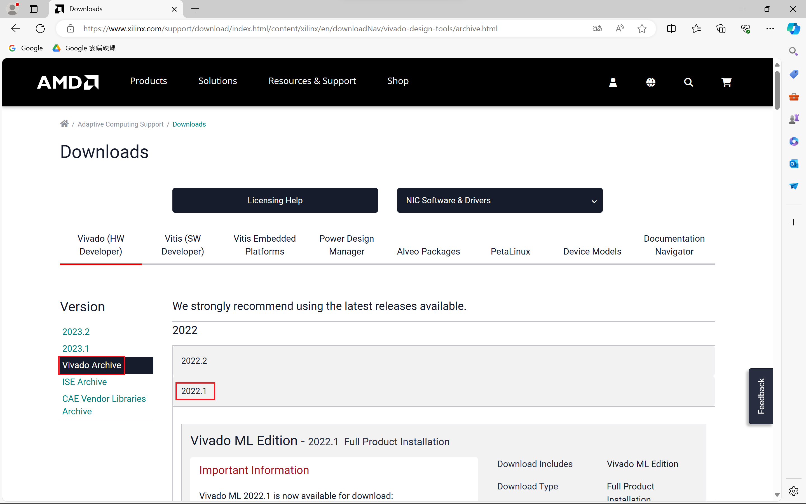
  
## 下載 Xilinx Unified Installer 2022.1: Windows Self Extracting Web Installer (EXE - 205.92 MB)  
本人使用`Windows 11`系統故安裝`Xilinx Unified Installer 2022.1: Windows Self Extracting Web Installer (EXE - 205.92 MB)`  
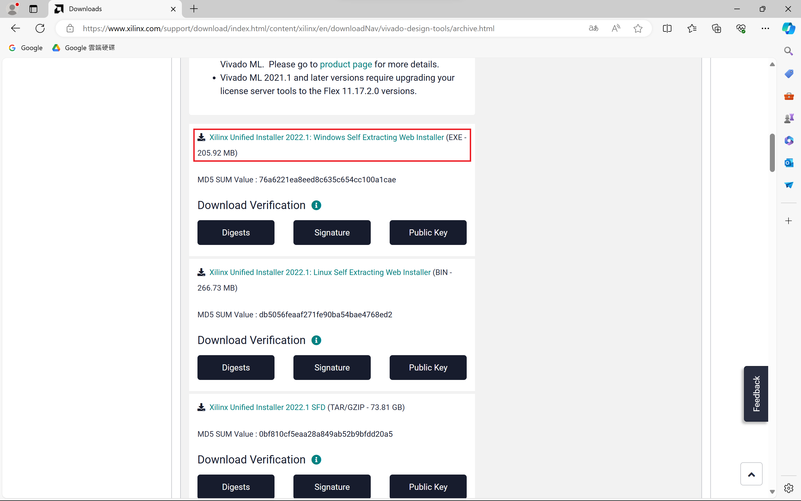
  
## 登入 AMD 帳號  
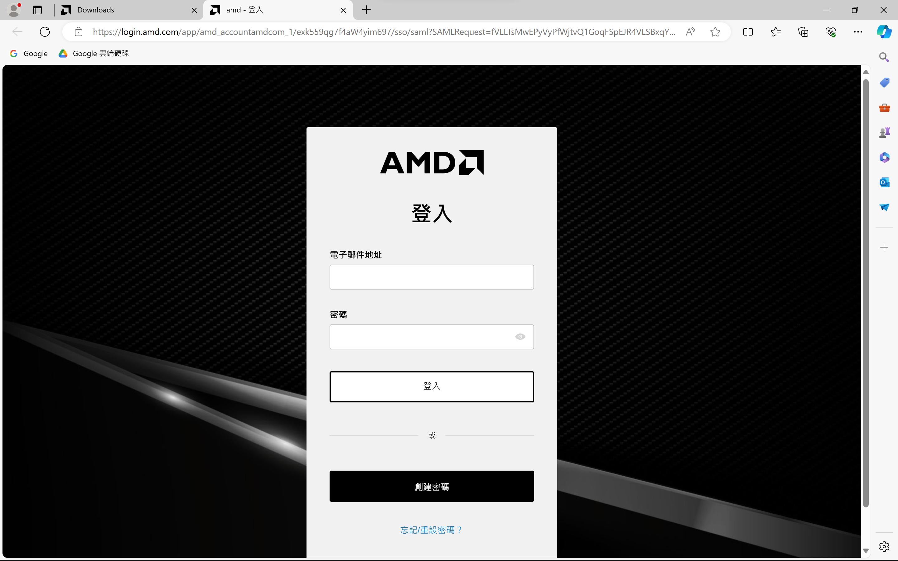
  
## 下載 Xilinx_Unified_2022.1_0420_0327_Win64.exe  
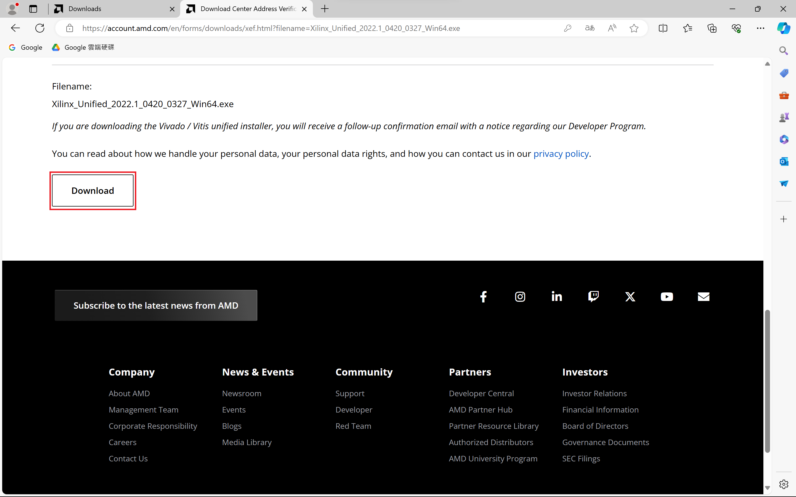
  
## 執行 Xilinx_Unified_2022.1_0420_0327_Win64.exe  
  
## 允許 OpenJDK  
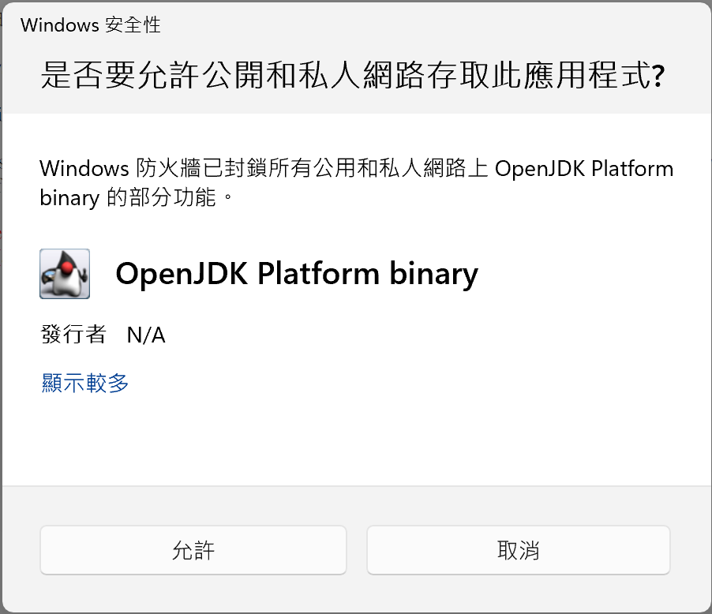
  
## 詢問新版本點 Continue 繼續  
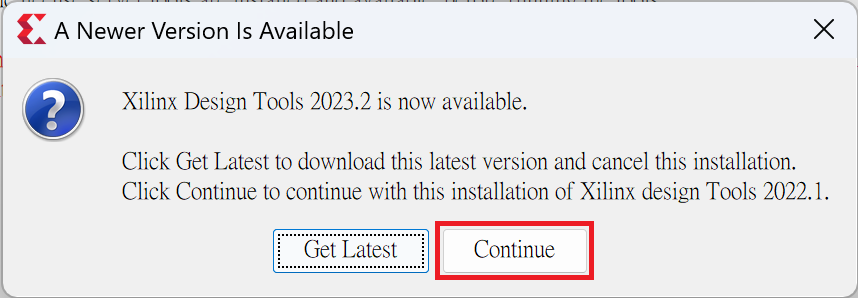
  
## 點 Next  
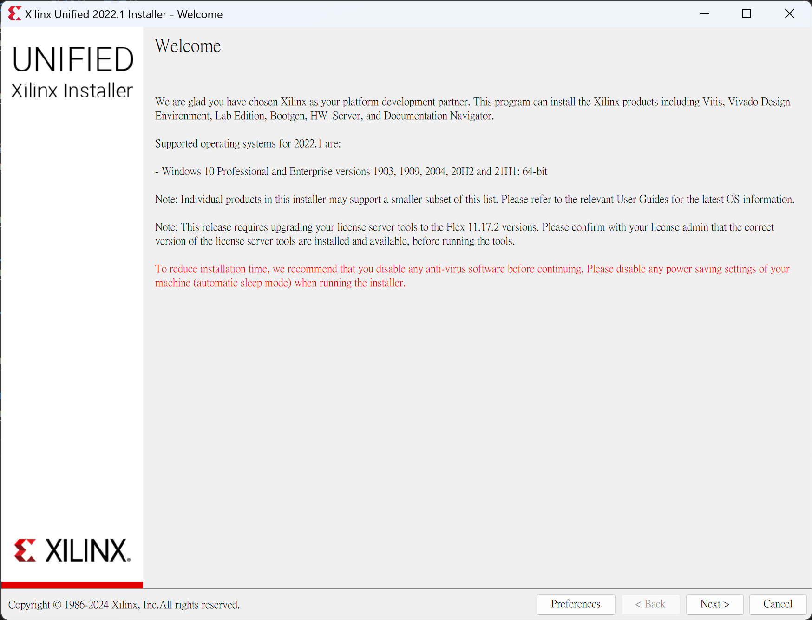
  
## 輸入帳密後點 Next  
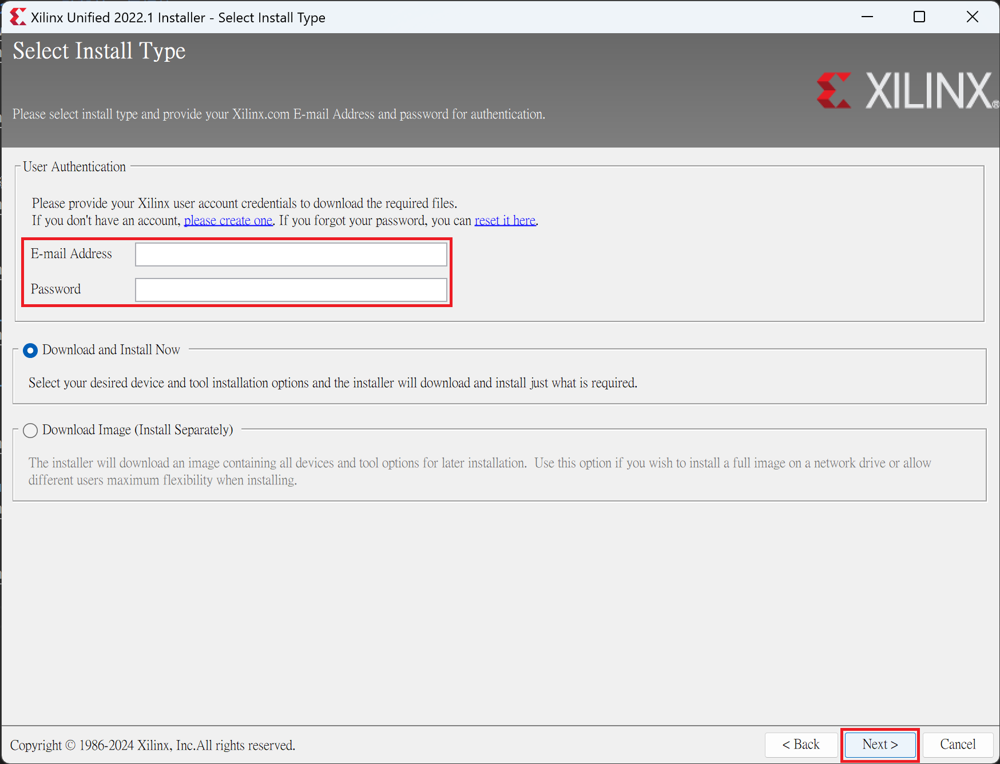
  
## 選擇 Vitis 後按 Next  
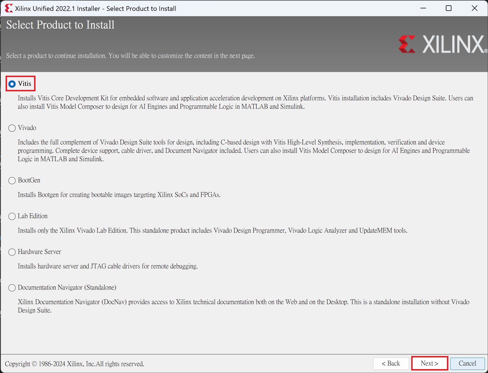
  
## 留下 Zynq-7000 系列後按 Next  
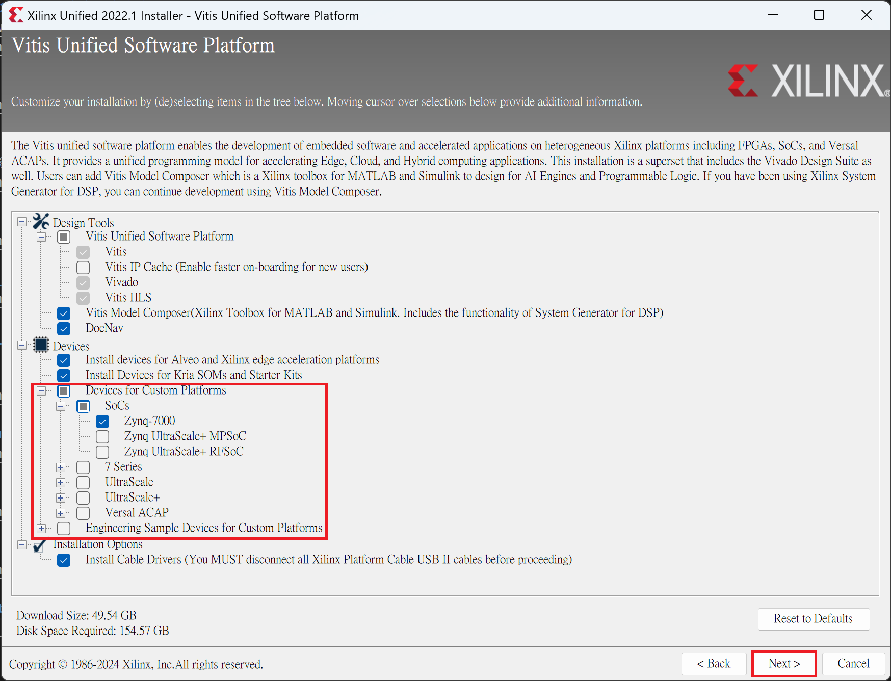
  
## 勾選同意列表後按 Next  
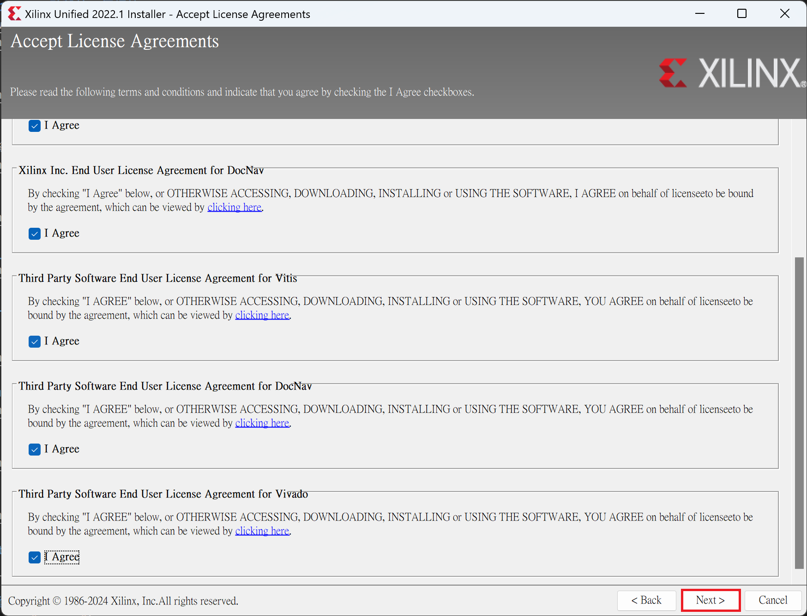
  
## 自訂義安裝選項後按 Next  
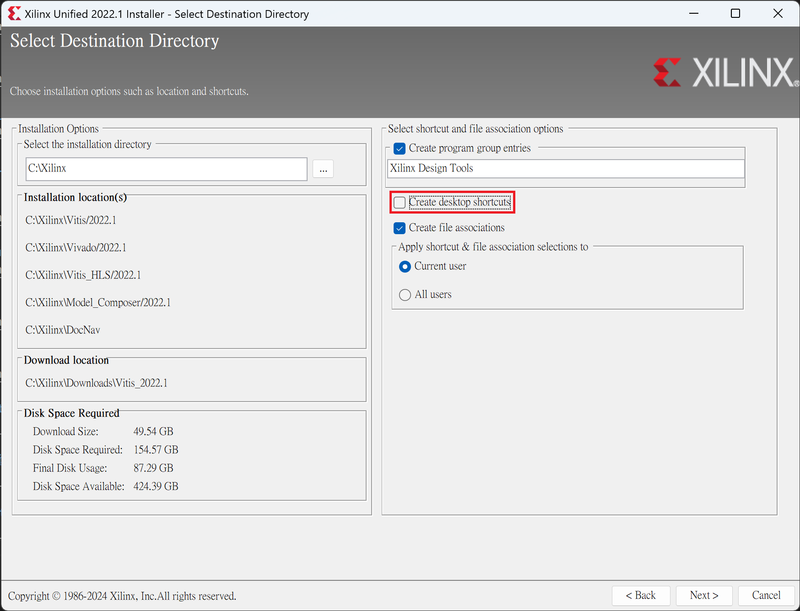
  
## 安裝程式新建資料夾按 OK  

  
## 點擊 Install 開始下載  
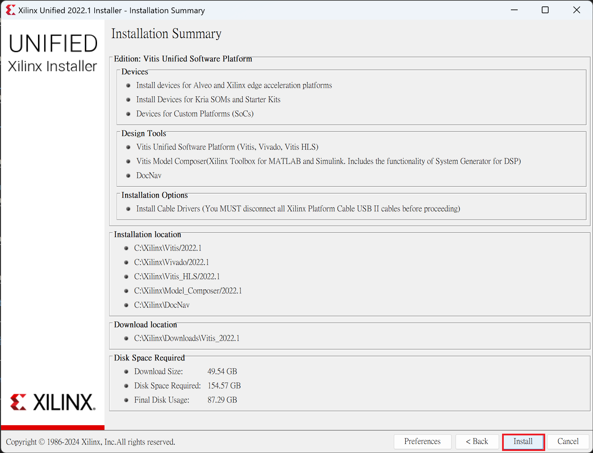
  
## 等待下載完成  
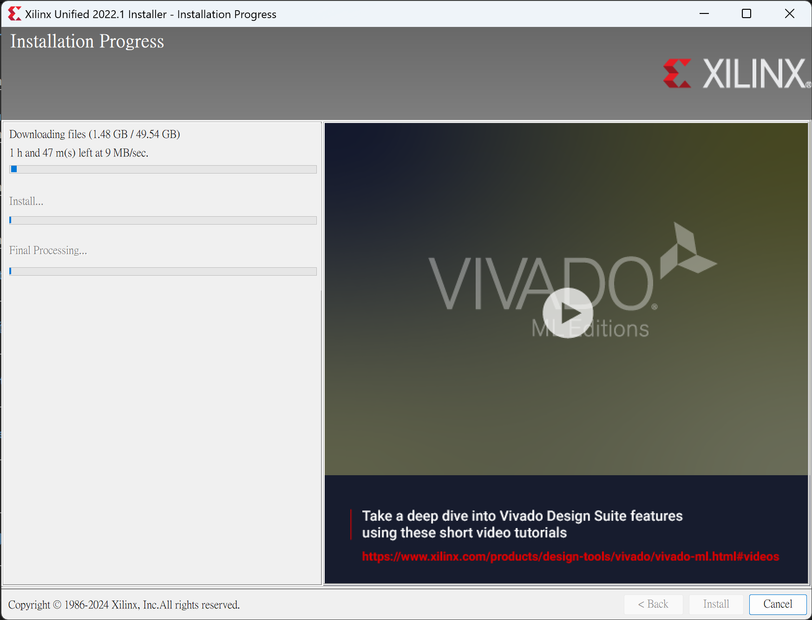