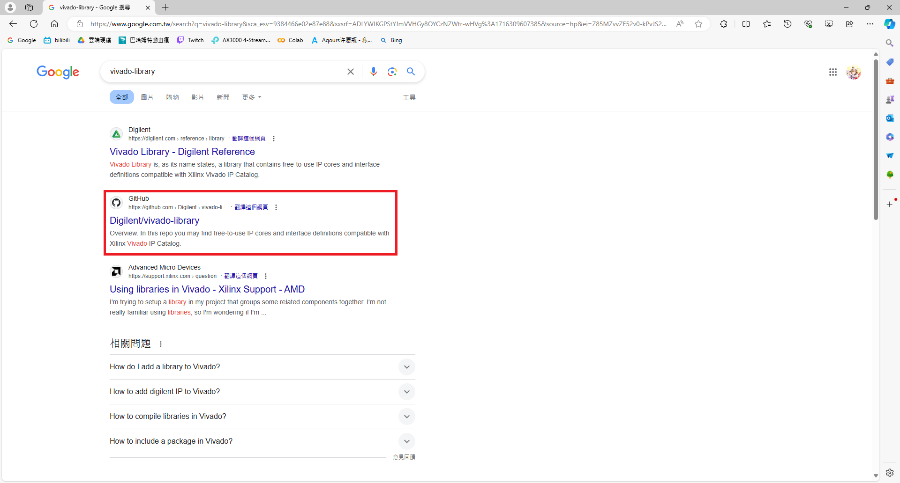
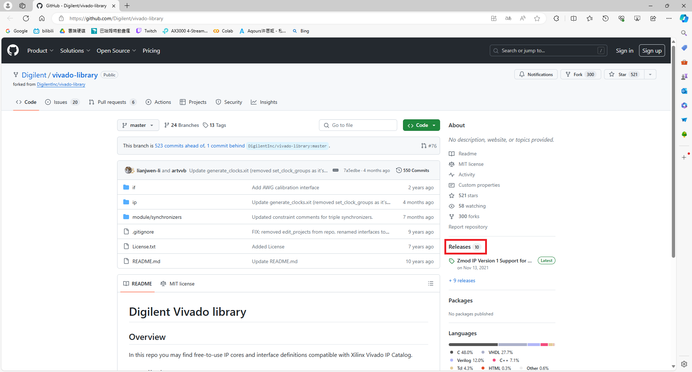
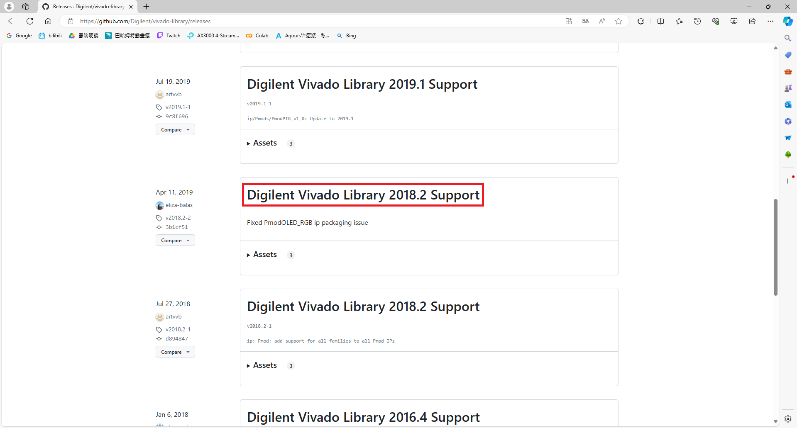
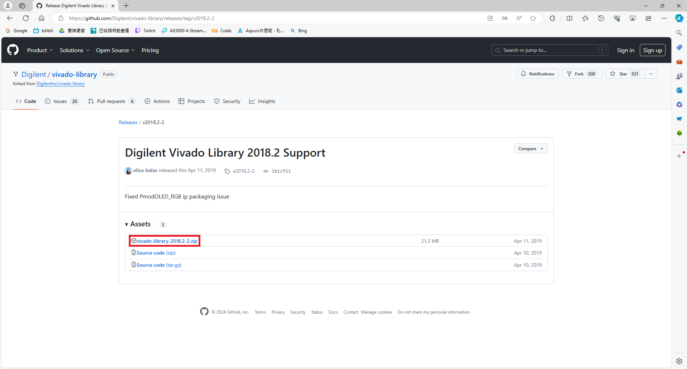
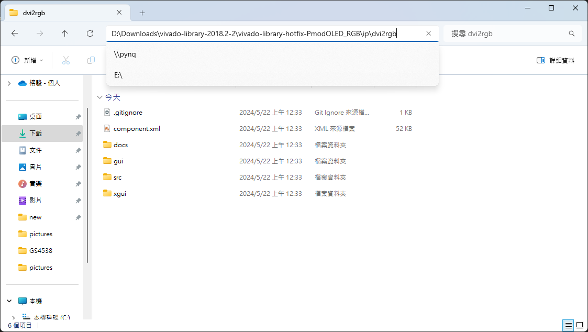
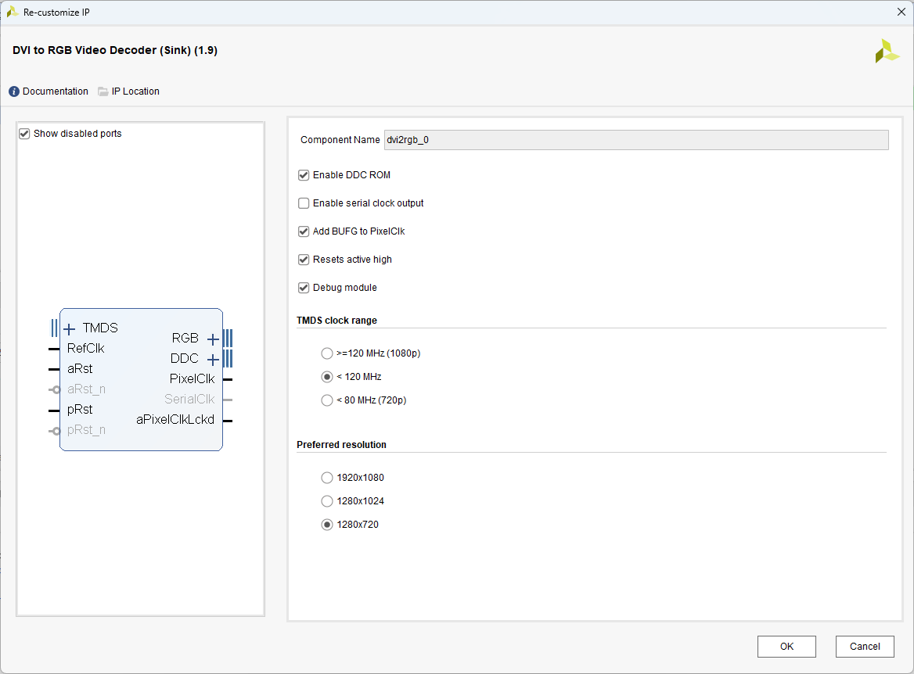

# Lab 2: DVI-to-RGB (Sink) 1.9 IP Core  
## 下載 DVI-to-RGB (Sink) 1.9 IP Core  
1. Google 搜尋`ivado-library`點擊[ GitHub 網站](https://github.com/Digilent/vivado-library)  

  
2. 點擊 Releases  

  
3. 點擊 Digilent Vivado Library 2018.2 Support  

  
4. 下載`vivado-library-2018.2-2.zip`並解壓縮檔案  

  
5. `DVI-to-RGB (Sink) 1.9 IP Core`位於`vivado-library-2018.2-2/vivado-library-hotfix-PmodOLED_RGB/ip/dvi2rgb`中  

  
## DVI-to-RGB (Sink) 1.9 IP Core  
1. 在 Vivado 中使用此 IP 能自訂義部分如下表:  
|選項|說明|
|:---|:---|
|Enable DDC ROM|決定 DDC 是否啟用|
|Enable serial clock output|決定 SerialClk 是否啟用|
|Resets active high|決定`aRst`和`pRst`是`1`或`0`啟用|

  
2. 參考`dvi2rgb/docs/dvi2rgb.pdf`可知訊號內容如下表:  
|訊號|說明|
|:---|:---|
|TMDS|包含 Clk_p/Clk_n 、Data_p[2:0]/Data_n[2:0] 等訊號|
|RefClk|接 200 MHz 時鐘訊號|
|aRst 或 aRst_n|Asynchronous reset。RefClk 不在規格範圍內時要啟用|
|pRst 或 pRst_n|只有在 PixelClk 上升沿時才會被識別並執行重置動作|
|RGB|包含 pVDE、pHSync、pVSync 和 pData (23:0) 訊號|
|DDC|包含 SCL、SDA 等 DDC 的訊號|
|aPixelClkLckd|對於 PixelClk 的 Active-high asynchronous locked signal。當 low 時，PixelClk 丟失或不符合規格|
|PixelClk|從 TMDS 時鐘通道恢復的像素時鐘|
|SerialClk|頻率為 PixelClk 的五倍|
  
其中`pVDE`代表 Active video (=1) 或 Blanking period (=0)