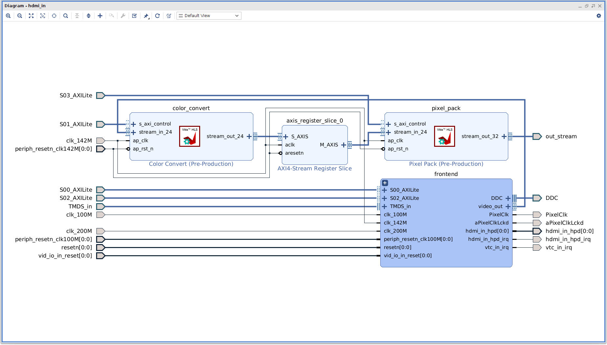

# Lab 3: 官方的 base.bit 的 hdmi_in 分析  
## hdmi_in 部分  
`base.bit`中的`hdmi_in`部分如圖一  
  
  
## Pixel Pack IP  
需要將 24 bits 的 RGB 訊號轉成 32 bits 的倍數，是由`Pixel Pack`這個 IP 完成的  
參考[官方倉庫](https://github.com/Xilinx/PYNQ/blob/master/boards/ip/hls/pixel_pack/pixel_pack.cpp)的代碼  
```c++
switch (mode) {
	case V_24:
		while (!delayed_last) {
#pragma HLS pipeline II=4
			delayed_last = last;
			ap_uint<96> buffer;
			ap_uint<4> has_last;
			ap_uint<4> has_user;
			for (int j = 0; j < 4; ++j) {
				if (!last) {
					stream_in_24.read(in_pixel);
					buffer(j*24 + 23, j*24) = in_pixel.data;
					has_user[j] = in_pixel.user;
					has_last[j] = in_pixel.last;
					last = in_pixel.last;
				}
			}
			if (!delayed_last) {
				for (int i = 0; i < 3; ++i) {
					out_pixel.data = buffer(i*32 + 31, i*32);
					out_pixel.user = has_user[i];
					out_pixel.last = has_last[i+1];
					stream_out_32.write(out_pixel);
				}
			}
		}
		break;
```
