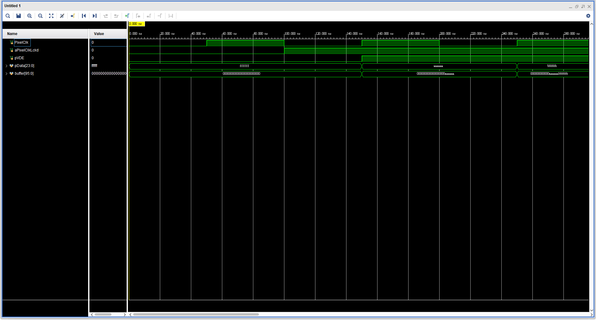
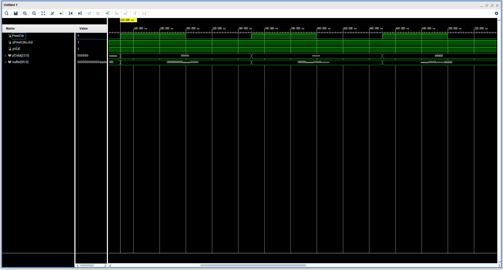
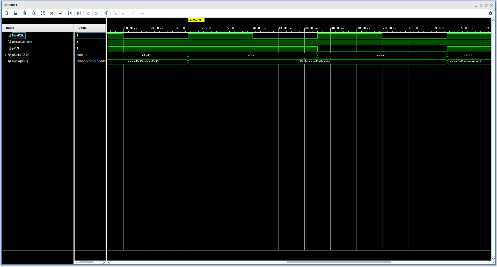
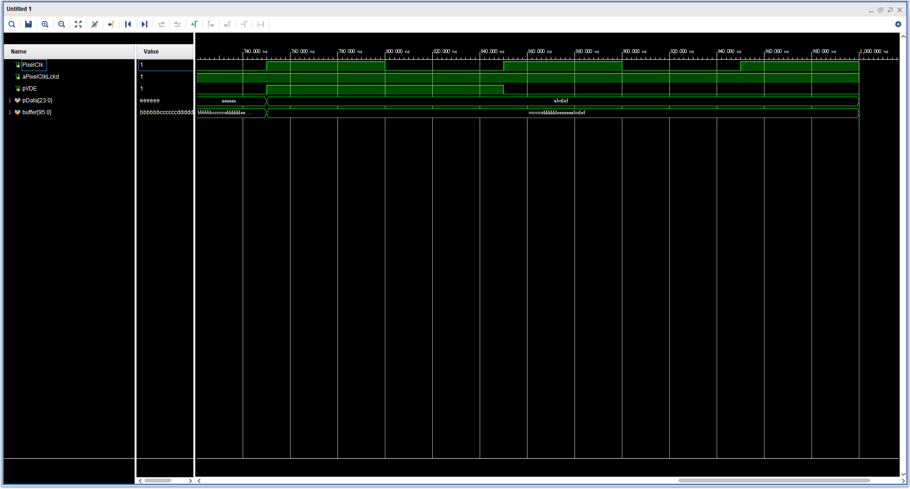

# Lab 4: 24 bit 輸入放入 96 bit buffer    
## Verilog  
```v
module Buffer(
    input wire PixelClk,
    input wire aPixelClkLckd,
    input wire pVDE,
    input wire [23:0] pData
);

reg [95:0] buffer;

always @(posedge PixelClk or negedge aPixelClkLckd) begin
    if (!aPixelClkLckd) begin
        buffer <= 96'b0;
    end else begin
        if (pVDE) begin
            buffer <= {buffer[71:0], pData};
        end else begin
            buffer <= buffer;
        end
    end
end

endmodule
```
  
1.  
定義了一個名為`Buffer`的模組，該模組有四個輸入：PixelClk、aPixelClkLckd、pVDE 和 pData（24 位元的像素數據）  
```v
module Buffer(
    input wire PixelClk,
    input wire aPixelClkLckd,
    input wire pVDE,
    input wire [23:0] pData
);
```
  
2.  
定義了一個 96 位元的暫存器陣列`buffer`  
```v
reg [95:0] buffer;
```
  
3.  
定義了一個`always`區塊，在`PixelClk`的上升沿或`aPixelClkLckd`的下降沿時被觸發。  
如果`aPixelClkLckd `為 0，則`buffer`被清零。  
否則，如果`pVDE 為`1，則`buffer`的最新 24 位元被設定為`pData`，其餘位元向左移動。  
如果`pVDE`為 0，則`buffer`的值保持不變。  
```v
always @(posedge PixelClk or negedge aPixelClkLckd) begin
    if (!aPixelClkLckd) begin
        buffer <= 96'b0;
    end else begin
        if (pVDE) begin
            buffer <= {buffer[71:0], pData};
        end else begin
            buffer <= buffer;
        end
    end
end
```
  
4.  
`Buffer`模組的結束  
```v
endmodule
```
  
## Verilog TestBench  
```v
`timescale 1ns / 1ps

module Buffer_tb;

    reg PixelClk;
    reg aPixelClkLckd;
    reg pVDE;
    reg [23:0] pData;

    Buffer u1 (
        .PixelClk(PixelClk), 
        .aPixelClkLckd(aPixelClkLckd), 
        .pVDE(pVDE), 
        .pData(pData)
    );

    initial begin
        PixelClk = 0;
        aPixelClkLckd = 0;
        pVDE = 0;
        pData = 24'hFFFFFF;
        #100; aPixelClkLckd = 1;
        #50; pVDE = 1; pData = 24'hAAAAAA;
        #100; pData = 24'hBBBBBB;
        #100; pData = 24'hCCCCCC;
        #100; pData = 24'hDDDDDD;
        #100; pData = 24'hEEEEEE;
        #100; pVDE = 0; pData = 24'hAAAAAA;
        #100; pVDE = 1; pData = 24'hABCDEF;
        #100; pVDE = 0;
        #100;
    end

    always #50 PixelClk = ~PixelClk; // Clock generator

endmodule
```
  
模擬波形:  
1.  

  
2.  

  
3.  

  
4.  

  
設定模擬的時間尺度。在這裡，1ns (奈秒) 是模擬的時間單位，而 1ps (皮秒) 是模擬的精度  
```v
`timescale 1ns / 1ps
```
  
定義了一個名為`Buffer_tb`的模組  
```v
module Buffer_tb;
```
  
定義了測試的輸入和輸出信號。`reg`關鍵字用於定義輸入信號，而`wire`關鍵字用於定義輸出信號  
```v
reg PixelClk;
reg aPixelClkLckd;
reg pVDE;
reg [23:0] pData;
```
  
實例化`Buffer`模組並將其輸入連接測試信號  
```v
Buffer u1 (
    .PixelClk(PixelClk), 
    .aPixelClkLckd(aPixelClkLckd), 
    .pVDE(pVDE), 
    .pData(pData)
);
```
  
這段`initial`區塊定義了模擬開始時的初始條件和輸入信號的變化。`#100`表示等待 100 單位時間  
```v
initial begin
    PixelClk = 0;
    aPixelClkLckd = 0;
    pVDE = 0;
    pData = 24'hFFFFFF;
    #100; aPixelClkLckd = 1;
    #50; pVDE = 1; pData = 24'hAAAAAA;
    #100; pData = 24'hBBBBBB;
    #100; pData = 24'hCCCCCC;
    #100; pData = 24'hDDDDDD;
    #100; pData = 24'hEEEEEE;
    #100; pVDE = 0; pData = 24'hAAAAAA;
    #100; pVDE = 1; pData = 24'hABCDEF;
    #100; pVDE = 0;
    #100;
end
```
  
生成一個時鐘信號。每 50 單位時間，`PixelClk`信號就會翻轉  
```v
always #50 PixelClk = ~PixelClk; // Clock generator
```
  
表示`Buffer_tb`模組的結束  
```v
endmodule
```