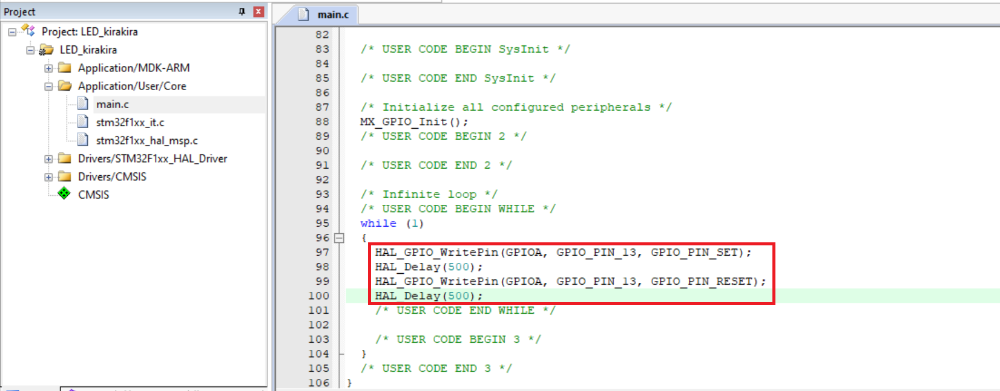

# Project 1: 點亮 PC13 的 LED 燈    
此專案將把`STM32F103C8T6`的`PC13`的 LED 燈點亮  
  
## Keil µVision5  
`Keil µVision5`提示有文件缺失  

  
專案需要`Keil:STM32F1xx_DFP@2.3.1`  

  
選擇`OK`  

  
等待右下方進度條跑完  

  
安裝完成  

  
回到`Keil µVision5`點擊重新載入  

  
`Keil µVision5`介面如下  

  
點開`Application/User/Core`中的`main.c`  

  
操控 GPIO 的函數 `HAL_GPIO_WritePin` 位於 `Drivers/STM32F1xx_HAL_Driver/Src/stm32f1xx_hal_gpio.c`中  

  
延遲時間的函數 `HAL_Delay` 位於 `Drivers/STM32F1xx_HAL_Driver/Src/stm32f1xx_hal.c`中  

  
將下方程式寫入`main.c`中 **注意程式的位置**  
```c
HAL_GPIO_WritePin(GPIOC, GPIO_PIN_13, GPIO_PIN_SET);
HAL_Delay(500);
HAL_GPIO_WritePin(GPIOC, GPIO_PIN_13, GPIO_PIN_RESET);
HAL_Delay(500);
```
**圖中 GPIOC 打錯成 GPIOA**

  
按下`Build`的圖示  

  
出現`Target uses ARM-Compoler 'Default Compiler Version 5' which is not available`錯誤  

  
按下`Options for Target...`的圖示  

  
在`Target`中的`ARM Compiler`選擇`Use default compiler version 6`後重新`Build`一次  

  
按下`Load`的圖示  

  
出現`Not a genuine ST Device! Abort connection`錯誤 **看的懂英文應該知道意思吧**  

  
錯誤後續  

  
因錯誤停止下載  

  
按下`Options for Target...`的圖示  

  
在`Debug`中選擇右邊的`Settings`  

  
把`Enable`取消打勾    

  
重新按下`Load`的圖示後成功燒錄即可看到 LED 閃爍的效果  
