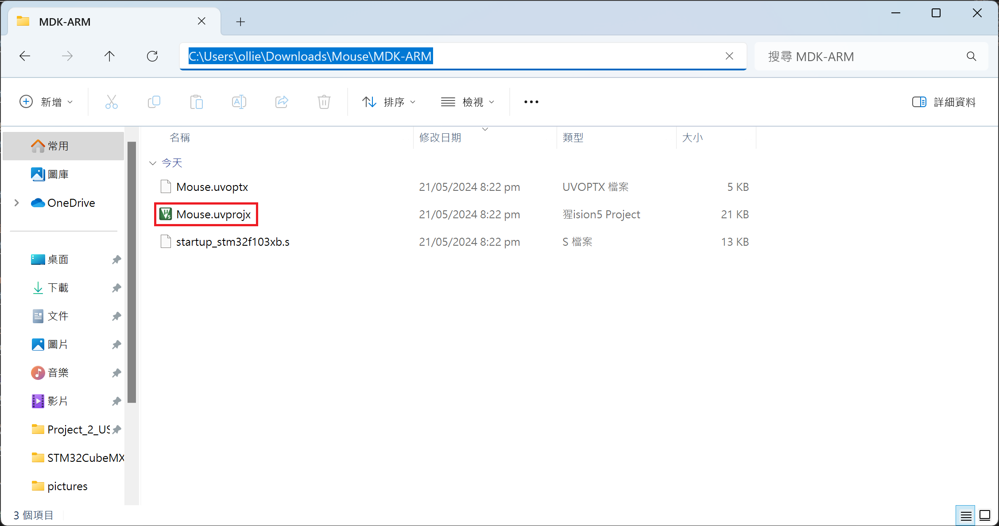
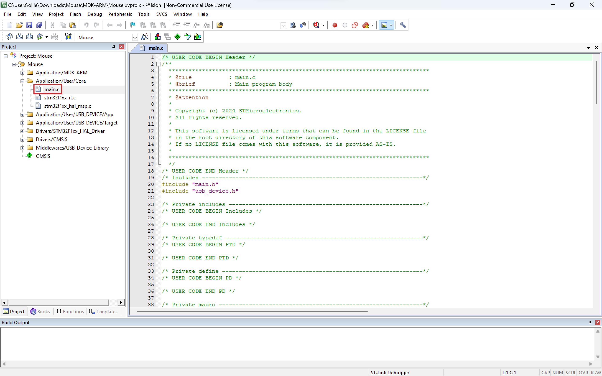
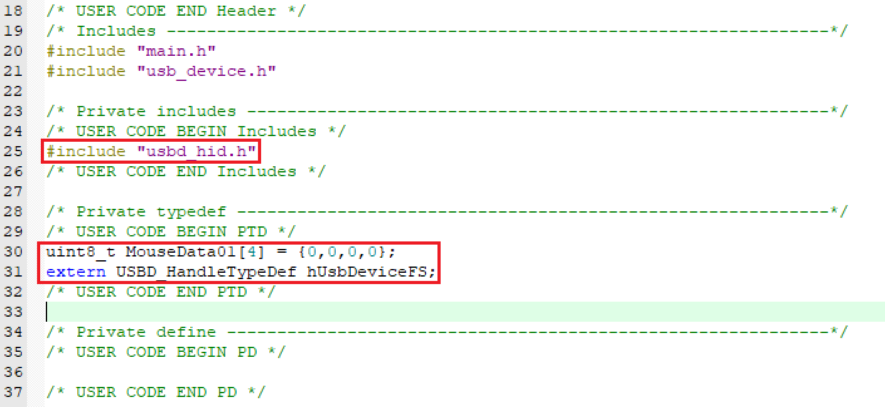
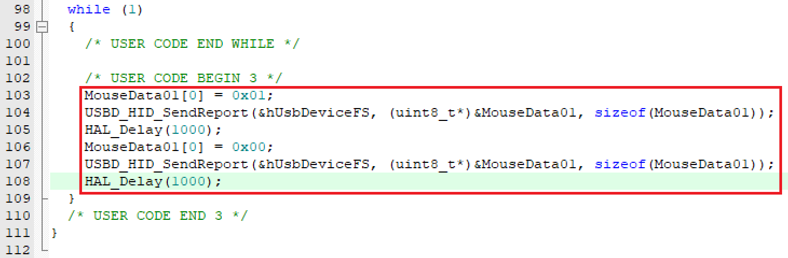
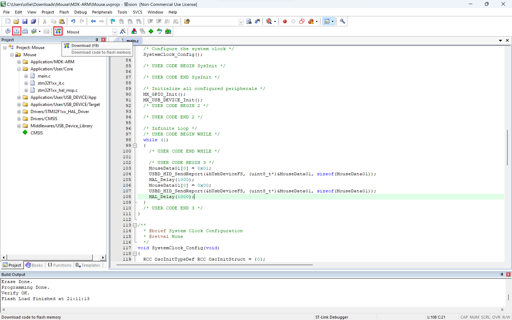
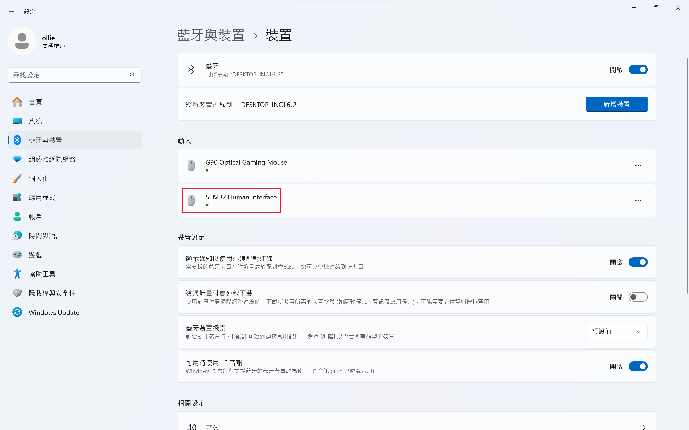
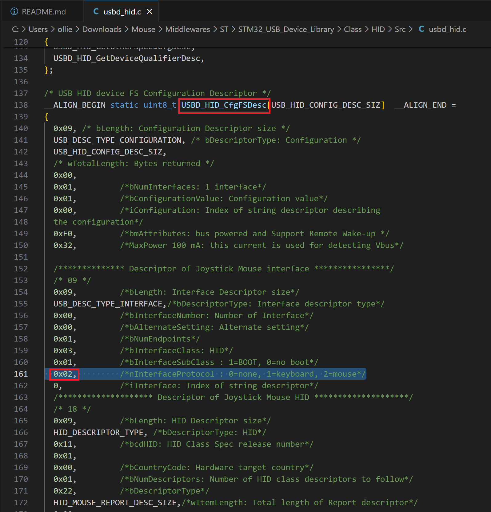

# Project 2: USB 滑鼠模擬  
此專案參考[基于STM32CubeMX的USB鼠标例程](http://www.mcublog.cn/software/2020_03/stm32cube-mouse/)這篇文章將`STM32F103C8T6`模擬成一個`USB`滑鼠  
  
## Keil µVision5  
在`Mouse/MDK-ARM`的子資料夾開啟`Mouse.uvprojx`檔案  
***註: Mouse 是我的專案名***  

  
開啟`Application/User/Core`中的`main.c`  

  
新增下面的程式碼:
1. 在`USER CODE BEGIN Includes`和`USER CODE END Includes`中新增下方程式碼
```c
#include "usbd_hid.h"
```
  
2. 在`USER CODE BEGIN PTD`和`USER CODE END PTD`中新增下方程式碼
```c
uint8_t MouseData01[4] = {0,0,0,0};
extern USBD_HandleTypeDef hUsbDeviceFS;
```

  
在`main(void)`函數的`while (1)`中新增下面的程式碼:
```c
MouseData01[0] = 0x01;
USBD_HID_SendReport(&hUsbDeviceFS, (uint8_t*)&MouseData01, sizeof(MouseData01));
HAL_Delay(1000);
MouseData01[0] = 0x00;
USBD_HID_SendReport(&hUsbDeviceFS, (uint8_t*)&MouseData01, sizeof(MouseData01));
HAL_Delay(1000);
```

  
進行`Build`和`Download`到`STM32F103C8T6`板子上。  

  
將燒錄器從電腦拔除後，將`STM32F103C8T6`板子插上`Micro USB`的連接線至電腦即可多了一個`STM32 Human interface`輸入設備  
***系統>藍芽與裝置>裝置***  

  
`STM32F103C8T6`模擬的滑鼠會模擬左鍵的點擊與放開行為  
  
## usbd_hid.c  
`usbd_hid.c`位於`Mouse/Middlewares/ST/STM32_USB_Device_Library/Class/HID/Src`中  
  
`USBD_HID_CfgFSDesc`某一段的`0x02`代表為一個`USB`的滑鼠  
```c
0x02,         /*nInterfaceProtocol : 0=none, 1=keyboard, 2=mouse*/
```

  
## HAL_Delay(uint32_t Delay)  
`HAL_Delay(uint32_t Delay)`位於`Mouse/Drivers/STM32F1xx_HAL_Driver/Src/stm32f1xx_hal.c`中  
```c
/**
  * @brief This function provides minimum delay (in milliseconds) based
  *        on variable incremented.
  * @note In the default implementation , SysTick timer is the source of time base.
  *       It is used to generate interrupts at regular time intervals where uwTick
  *       is incremented.
  * @note This function is declared as __weak to be overwritten in case of other
  *       implementations in user file.
  * @param Delay specifies the delay time length, in milliseconds.
  * @retval None
  */
__weak void HAL_Delay(uint32_t Delay)
{
  ......
}
```
  
## USBD_HID_SendReport(USBD_HandleTypeDef  *pdev, uint8_t *report, uint16_t len)  
`USBD_HID_SendReport(USBD_HandleTypeDef  *pdev, uint8_t *report, uint16_t len)`位於`Mouse/Middlewares/ST/STM32_USB_Device_Library/Class/HID/Src/usbd_hid.c`中  
```c
/**
  * @brief  USBD_HID_SendReport
  *         Send HID Report
  * @param  pdev: device instance
  * @param  buff: pointer to report
  * @retval status
  */
uint8_t USBD_HID_SendReport(USBD_HandleTypeDef  *pdev,
                            uint8_t *report,
                            uint16_t len)
{
  ......
}
```