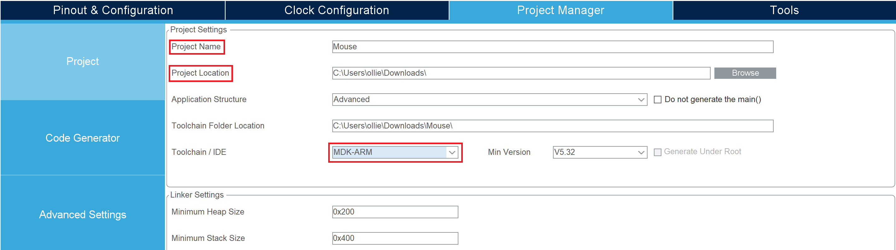

# Project 2: USB 滑鼠模擬  
此專案參考[基于STM32CubeMX的USB鼠标例程](http://www.mcublog.cn/software/2020_03/stm32cube-mouse/)這篇文章將`STM32F103C8T6`模擬成一個`USB`滑鼠  
  
## STM32CubeMX  
開啟一個關於`STM32F103C8T6`的 STM32CubeMX Project  

  
在`System Core`中的`RCC`選項把`High Speed Clock (HSE)`改成`Crystal/Ceramic Resonator`  

  
在`System Core`中的`SYS`選項把`Debug`改成`Serial Wire`  

  
在`Connectivity`中的`USB_DEVICE`選項把`Device`打勾  

  
在`Middleware and S....`中的`USB`選項把`Class For FS IP`改成`Human Interface Device Class (HID)`  

  
`Device Descriptor`中有關於`USB`設備的訊息  

  
點擊`Clock Configuration`選項，出現`Do you want to run automatic clock issues solver ?`訊息選`OK`  

  
等待一段時間完成時鐘的配置  

  
開啟`Project Manager`，自訂`Project Name`和`Project Location`並將`Toolchain / IDE`選擇`MDK-ARM`  

  
開啟`Code Generator`，選擇`Copy only the necessary library files`  

  
開啟`GENERATE CODE`等待程式碼完成  

  
按`Open Folder`會切換到專案的位置  

  
此時`STM32CubeMX`已經使用完畢可以關閉程式  