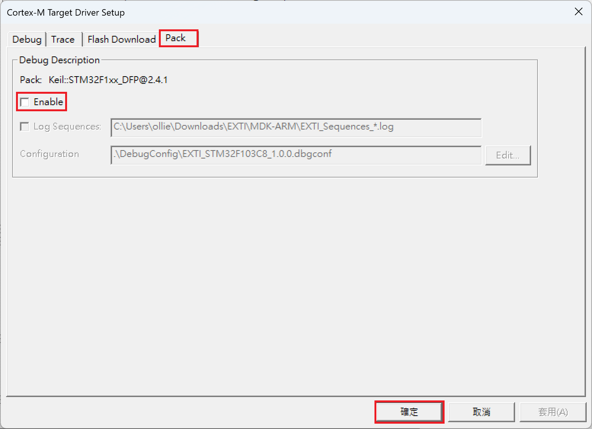

# Project 3: 利用外部中斷翻轉 PC13 LED 狀態  
此專案參考[Getting started with EXTI](https://wiki.st.com/stm32mcu/wiki/Getting_started_with_EXTI)  
  
## Keil µVision5  
開啟`Application/User/Core`中的`main.c`  

  
在`/* USER CODE BEGIN 4 */`和`/* USER CODE END 4 */`中新增下方程式碼
```c
void HAL_GPIO_EXTI_Callback(uint16_t GPIO_Pin)
{
  if(GPIO_Pin == GPIO_PIN_0) {
    HAL_GPIO_TogglePin(GPIOC, GPIO_PIN_13);
  } else {
      __NOP();
  }
}
```

***`HAL_GPIO_EXTI_Callback`位於`Drivers/STM32F1xx_HAL_Driver/Src/stm32f1xx_hal_gpio.c`***  
***`HAL_GPIO_TogglePin`位於`Drivers/STM32F1xx_HAL_Driver/Src/stm32f1xx_hal_gpio.c`***  
  
按下`Build`的圖示，出現藍框部分錯誤  

  
按下`Options for Target...`的圖示，在`Target`中的`ARM Compiler`選擇`Use default compiler version 6`  

  
在`Debug`中選擇右邊的`Settings`  

  
在`Pack`中把`Enable`取消打勾後點擊`確定`  

  
點擊`OK`  

  
點擊`ReBuild`圖示，重新 Build 一次，此時藍框部分無錯誤  

  
把板子接上燒錄器連接電腦進行燒錄  

  
下圖為更新訊息，可以不用接受  

  
此時`Keil µVision5`應用程式使用完畢可以關閉程式  