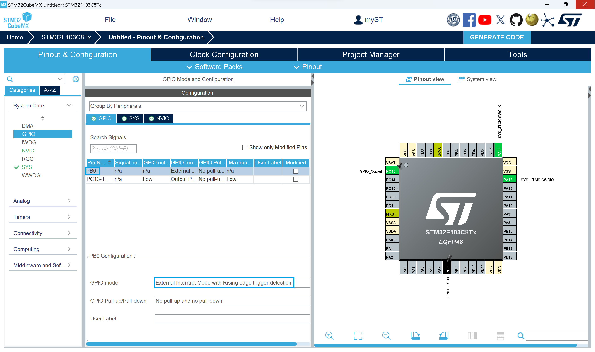

# Project 3: 利用外部中斷翻轉 PC13 LED 狀態  
此專案參考[Getting started with EXTI](https://wiki.st.com/stm32mcu/wiki/Getting_started_with_EXTI)  
  
## STM32CubeMX  
開啟`STM32CubeMX`應用程式，點擊`File`中的`New Project`  

  
在 Commercial Part Number 輸入`stm32f103c8t6`並在右邊選擇`stm32f103c8t6`選項，點擊右上角的`Start Project`  

  
在`System Core`中的`SYS`選項把`Debug`改成`Serial Wire`  

  
Pinout view 中在`PC13`腳位上左鍵選擇`GPIO_Output`  

  
Pinout view 中在`PB0`腳位上左鍵選擇`GPIO_EXTI0`  

  
點擊`System Core`中的`GPIO`選項  

  
點擊`PB0`中確保 GPIO mode 為 External Interrupt Mode with Rising edge trigger detection    

  
點擊`NVIC`選項將 EXTI line0 interrupt 的 Enabled 打勾  

  
點擊`System Core`中的`NVIC`選項，確保 EXTI line0 interrupt 的 Enabled 打勾  

  
點擊`Code generation`選項將 EXTI line0 interrupt 的後三項打勾  

  
開啟`Project Manager`，填寫 Project Name，選擇檔案位置以及將 Toolchain / IDE 選擇`MDK-ARM`  

  
開啟`Code Generator`，選擇`Copy only the necessary library files`  

  
等待程式生成完成  

  
按`Open Project`使用 Keil µVision5 開啟專案  

  
此時`STM32CubeMX`應用程式使用完畢可以關閉程式  