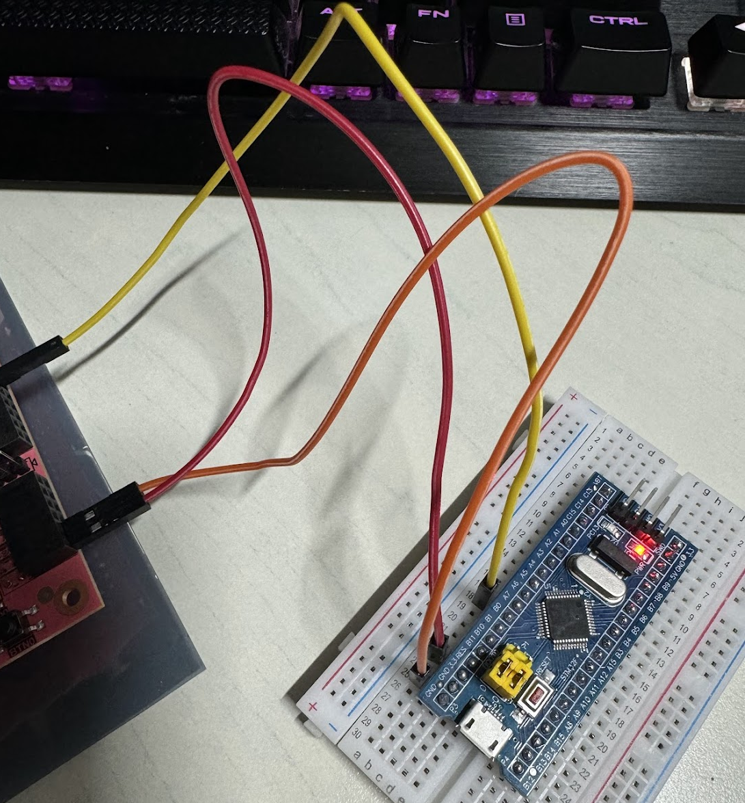

# Project 3: 利用外部中斷翻轉 PC13 LED 狀態  
此專案參考[Getting started with EXTI](https://wiki.st.com/stm32mcu/wiki/Getting_started_with_EXTI)  
  
## 說明  
參考[STM32F103C8T6 販賣網站](https://www.taiwaniot.com.tw/product/%E6%96%B0%E7%89%88stm32f103c8t6%E6%A0%B8%E5%BF%83%E6%9D%BF-stm32%E9%96%8B%E7%99%BC%E6%9D%BF-%E5%8E%9F%E5%BB%A0%E6%99%B6%E7%89%87-arm%E5%B5%8C%E5%85%A5%E5%BC%8F%E5%96%AE%E7%89%87%E6%A9%9F-%E7%9B%B8/)的原理圖可知`PB0`的電壓上限為`+ 3.3 V`  
  
參考[PYNQ 網站的 Pmod 網頁](https://pynq.readthedocs.io/en/latest/pynq_libraries/pmod.html)可知`PMOD`的接口位置，利用其`PMODB`進行供電  
  
利用程式可以控制`PMODA`的`Pin0`的電壓  
  
## 程式內容  
1. 
```python
from pynq.overlays.base import BaseOverlay
from pynq.lib import Pmod_IO
```
2. 
```python
# 載入 PYNQ Overlay
base = BaseOverlay("base.bit")
```
3. 
```python
# 初始化 PMOD 模組的數位信號引腳
pmod_io = Pmod_IO(base.PMODA, 0, 'out')
```
4. 
```python
# 將引腳設定為低電位
pmod_io.write(0)
```
5. 
```python
# 將引腳設定為高電位
pmod_io.write(1)
```
  
## 上電測試結果  
初始狀態:  

  
檢測到上升沿:  
