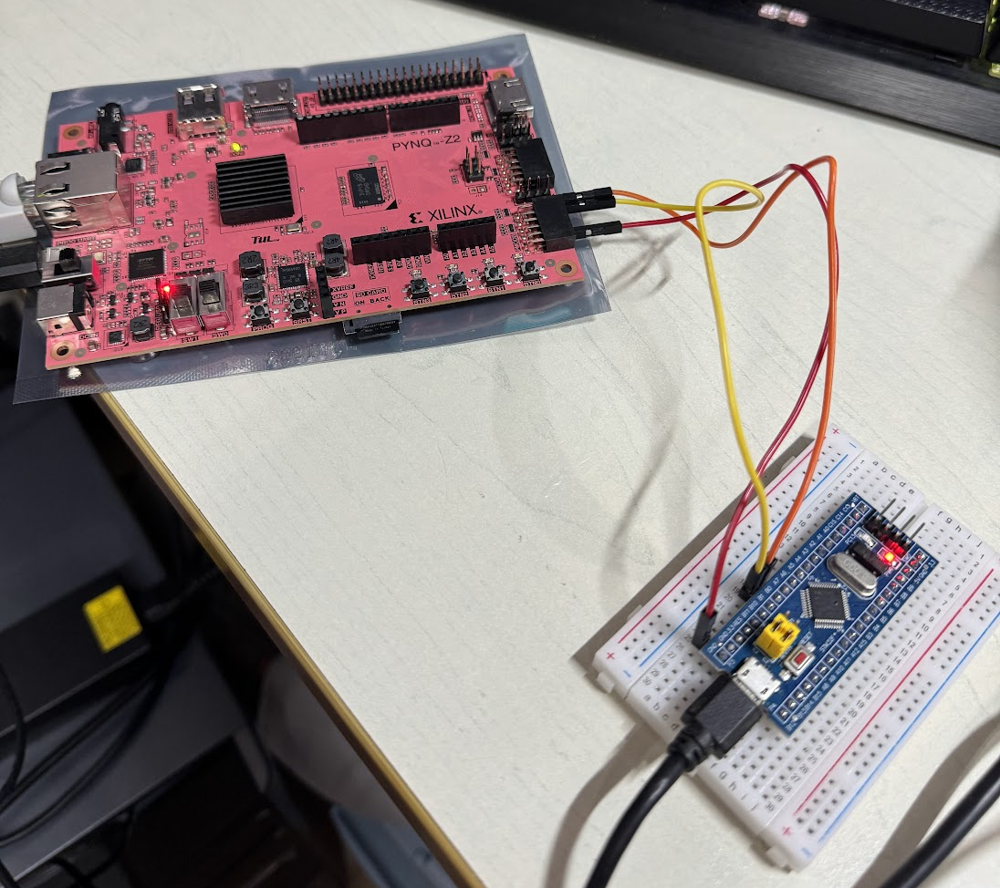

# Project 4: 利用外部中斷回報 USB 滑鼠狀態  
## 說明  
參考[STM32F103C8T6 販賣網站](https://www.taiwaniot.com.tw/product/%E6%96%B0%E7%89%88stm32f103c8t6%E6%A0%B8%E5%BF%83%E6%9D%BF-stm32%E9%96%8B%E7%99%BC%E6%9D%BF-%E5%8E%9F%E5%BB%A0%E6%99%B6%E7%89%87-arm%E5%B5%8C%E5%85%A5%E5%BC%8F%E5%96%AE%E7%89%87%E6%A9%9F-%E7%9B%B8/)的原理圖可知`PB0`和`PB1`的電壓上限為`+3.3 V`  
  
參考[PYNQ 網站的 Pmod 網頁](https://pynq.readthedocs.io/en/latest/pynq_libraries/pmod.html)可知`PMOD`的接口位置，利用其`PMODB`連接`GND`、`PB0`和`PB1`  

  
利用程式可以控制`PMODB`的`Pin0`和`Pin1`的電壓  
  
## 程式內容  
1. 
```python
from pynq.overlays.base import BaseOverlay
from pynq.lib import Pmod_IO
```
2. 
```python
# 載入 PYNQ Overlay
base = BaseOverlay("base.bit")
```
3. 
```python
# 初始化 PMOD 模組的數位信號引腳
pmod_io0 = Pmod_IO(base.PMODB, 0, 'out')
pmod_io1 = Pmod_IO(base.PMODB, 1, 'out')
```
4. 檢測到下降沿時，滑鼠向右移動  
```python
# 將引腳設定為高電位
pmod_io0.write(1)
# 將引腳設定為低電位
pmod_io0.write(0)
```
5. 檢測到下降沿時，滑鼠向下移動  
```python
# 將引腳設定為高電位
pmod_io1.write(1)
# 將引腳設定為低電位
pmod_io1.write(0)
```