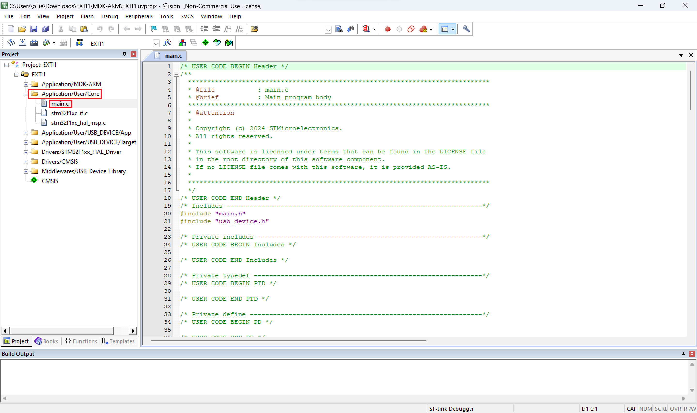
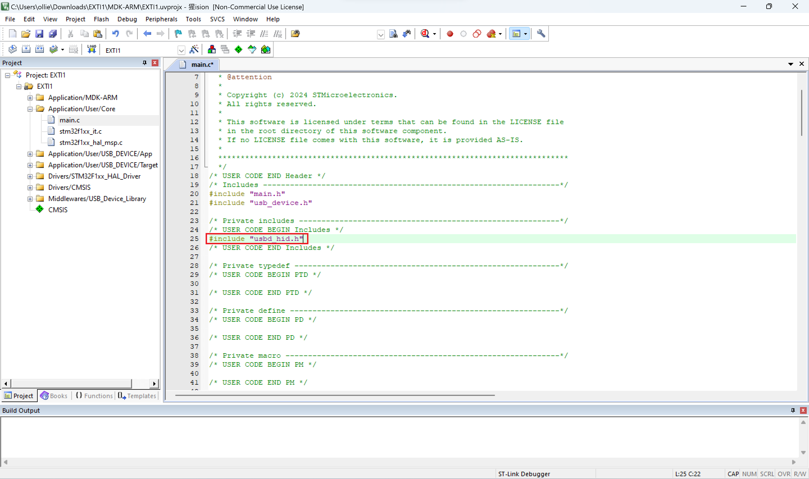
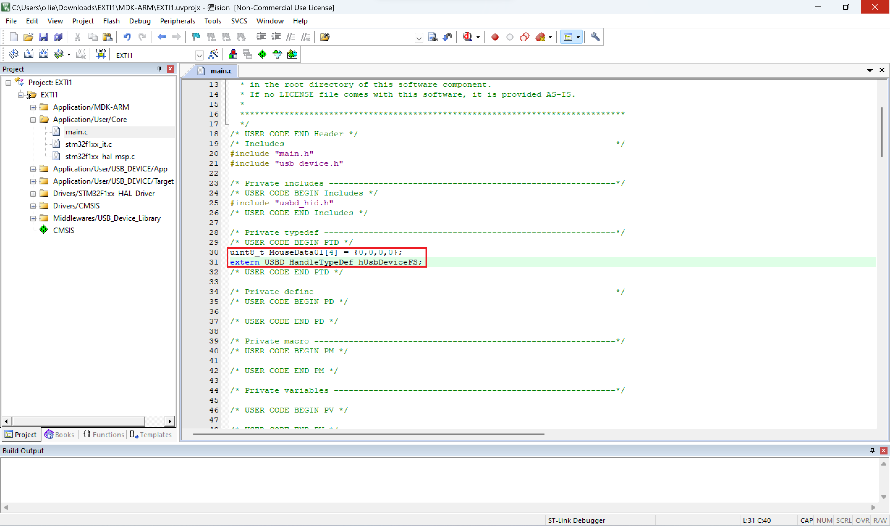
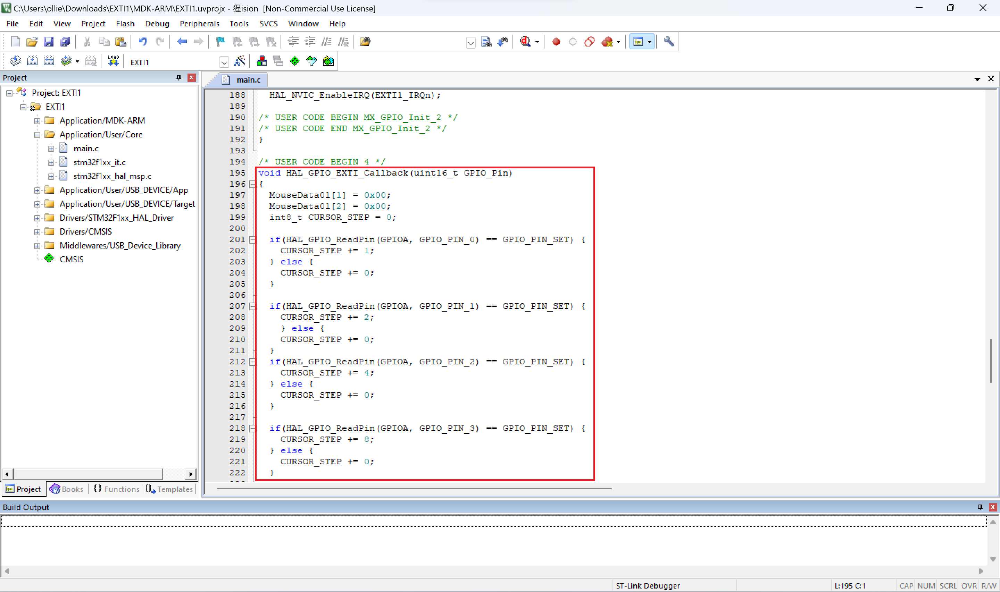
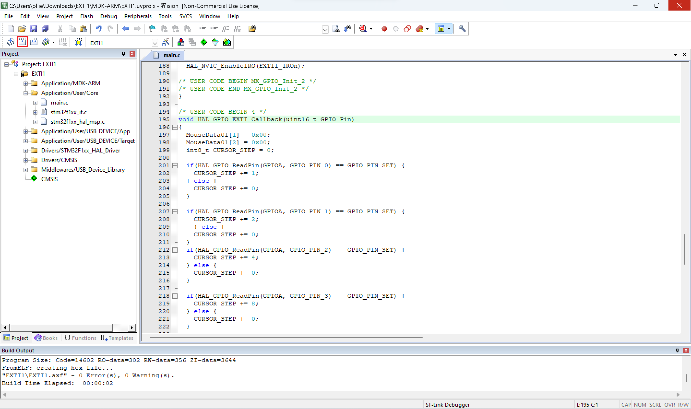
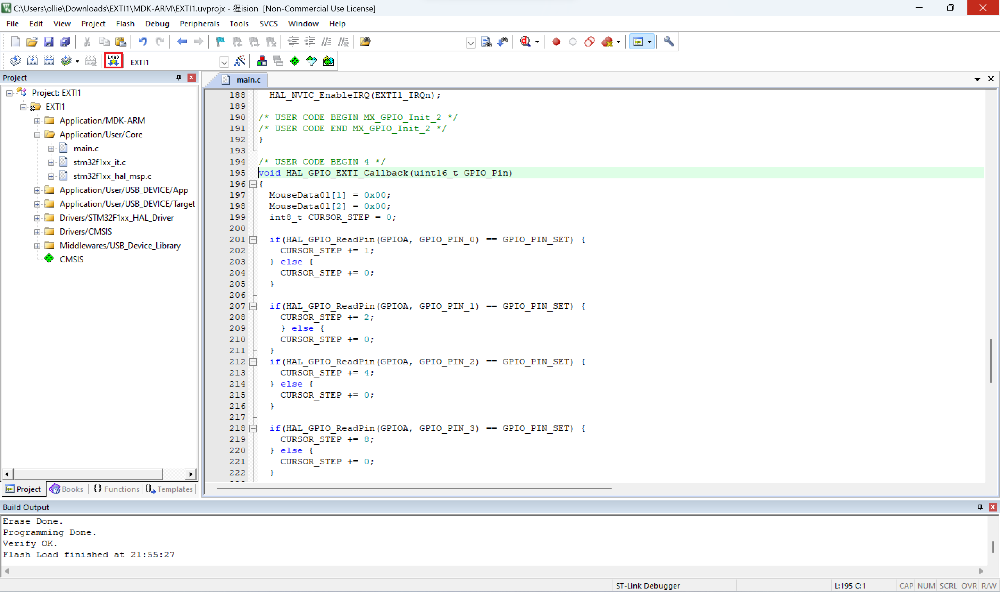

# Project 5: 利用外部中斷回報 USB 滑鼠的任意位移狀態  
## Keil µVision5  
開啟`Application/User/Core`中的`main.c`  

  
在`/* USER CODE BEGIN Includes */`和`/* USER CODE END Includes */`中新增下方程式碼  
```c
#include "usbd_hid.h"
```

  
在`/* USER CODE BEGIN PTD */`和`/* USER CODE END PTD */`中新增下方程式碼  
```c
uint8_t MouseData01[4] = {0,0,0,0};
extern USBD_HandleTypeDef hUsbDeviceFS;
```

  
在`/* USER CODE BEGIN 4 */`和`/* USER CODE END 4 */`中新增下方程式碼
```c
void HAL_GPIO_EXTI_Callback(uint16_t GPIO_Pin)
{
  MouseData01[1] = 0x00;
  MouseData01[2] = 0x00;
  int8_t CURSOR_STEP = 0;
	
  if(HAL_GPIO_ReadPin(GPIOA, GPIO_PIN_0) == GPIO_PIN_SET) {
    CURSOR_STEP += 1;
  } else {
		CURSOR_STEP += 0;
	}
		
	if(HAL_GPIO_ReadPin(GPIOA, GPIO_PIN_1) == GPIO_PIN_SET) {
		CURSOR_STEP += 2;
		} else {
		CURSOR_STEP += 0;
	}
	if(HAL_GPIO_ReadPin(GPIOA, GPIO_PIN_2) == GPIO_PIN_SET) {
		CURSOR_STEP += 4;
	} else {
		CURSOR_STEP += 0;
	}
		
	if(HAL_GPIO_ReadPin(GPIOA, GPIO_PIN_3) == GPIO_PIN_SET) {
		CURSOR_STEP += 8;
	} else {
		CURSOR_STEP += 0;
	}
		
	if(HAL_GPIO_ReadPin(GPIOA, GPIO_PIN_4) == GPIO_PIN_SET) {
		CURSOR_STEP += 16;
	} else {
		CURSOR_STEP += 0;
	}
		
	if(HAL_GPIO_ReadPin(GPIOA, GPIO_PIN_5) == GPIO_PIN_SET) {
		CURSOR_STEP += 32;
	} else {
		CURSOR_STEP += 0;
	}
		
	if(HAL_GPIO_ReadPin(GPIOA, GPIO_PIN_6) == GPIO_PIN_SET) {
		CURSOR_STEP += 64;
	} else {
		CURSOR_STEP += 0;
	}
		
	if(HAL_GPIO_ReadPin(GPIOA, GPIO_PIN_7) == GPIO_PIN_SET) {
		CURSOR_STEP -= 128;
	} else {
		CURSOR_STEP += 0;
	}
	
	if(GPIO_Pin == GPIO_PIN_0) {
		MouseData01[1] = CURSOR_STEP;
		USBD_HID_SendReport(&hUsbDeviceFS, (uint8_t*)&MouseData01, sizeof(MouseData01));
  } else if(GPIO_Pin == GPIO_PIN_1) {
		MouseData01[2] = CURSOR_STEP;
		USBD_HID_SendReport(&hUsbDeviceFS, (uint8_t*)&MouseData01, sizeof(MouseData01));
  } else {
      __NOP();
  }
}
```

  
按下`Build`的圖示  

  
把板子接上燒錄器連接電腦進行燒錄  

  
此時`Keil µVision5`應用程式使用完畢可以關閉程式  