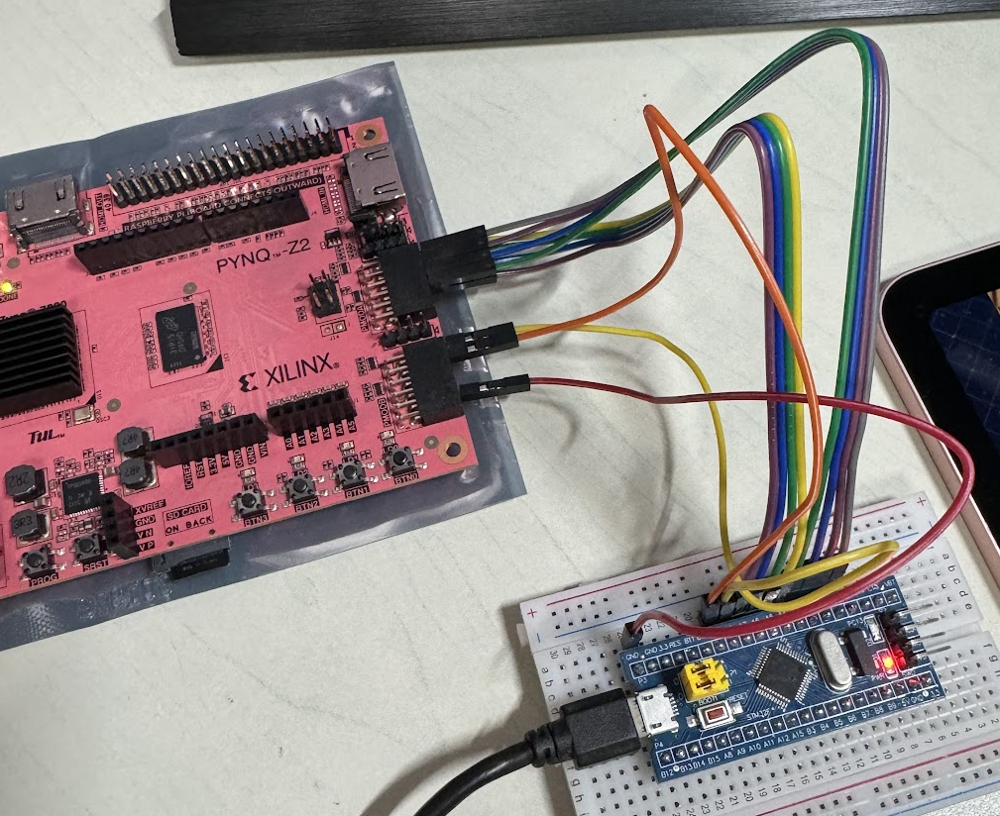

# Project 5: 利用外部中斷回報 USB 滑鼠的任意位移狀態  
## 說明  
參考[STM32F103C8T6 販賣網站](https://www.taiwaniot.com.tw/product/%E6%96%B0%E7%89%88stm32f103c8t6%E6%A0%B8%E5%BF%83%E6%9D%BF-stm32%E9%96%8B%E7%99%BC%E6%9D%BF-%E5%8E%9F%E5%BB%A0%E6%99%B6%E7%89%87-arm%E5%B5%8C%E5%85%A5%E5%BC%8F%E5%96%AE%E7%89%87%E6%A9%9F-%E7%9B%B8/)的原理圖可知`PB0`和`PB1`的電壓上限為`+3.3 V`  
  
參考[PYNQ 網站的 Pmod 網頁](https://pynq.readthedocs.io/en/latest/pynq_libraries/pmod.html)可知`PMOD`的接口位置  
1. `PMODA`連接`PA0`、`PA1`、`PA2`、`PA3`、`PA4`、`PA5`、`PA6`和`PA7`  
2. `PMODB`連接`GND`、`PB0`和`PB1`  
  
