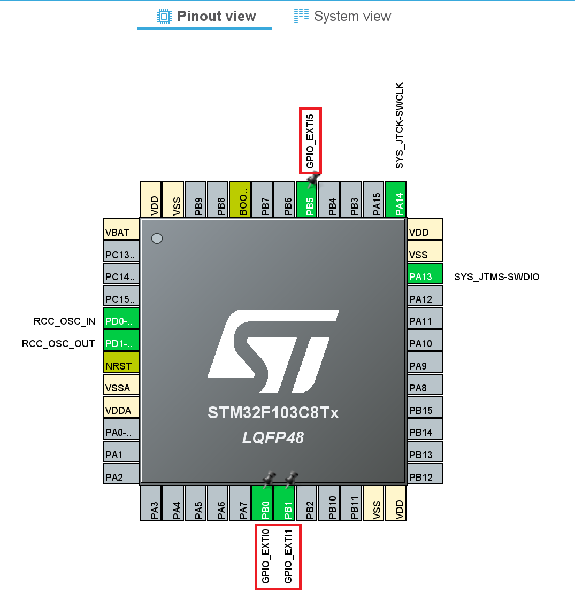
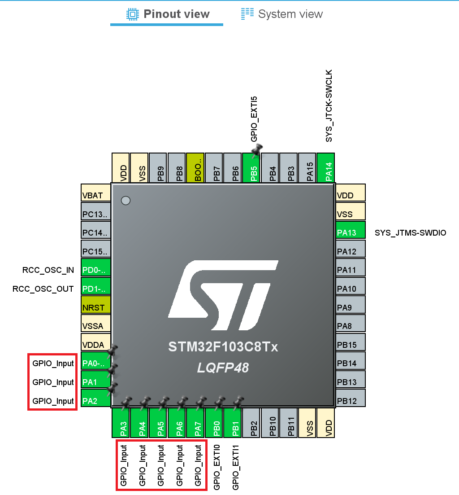
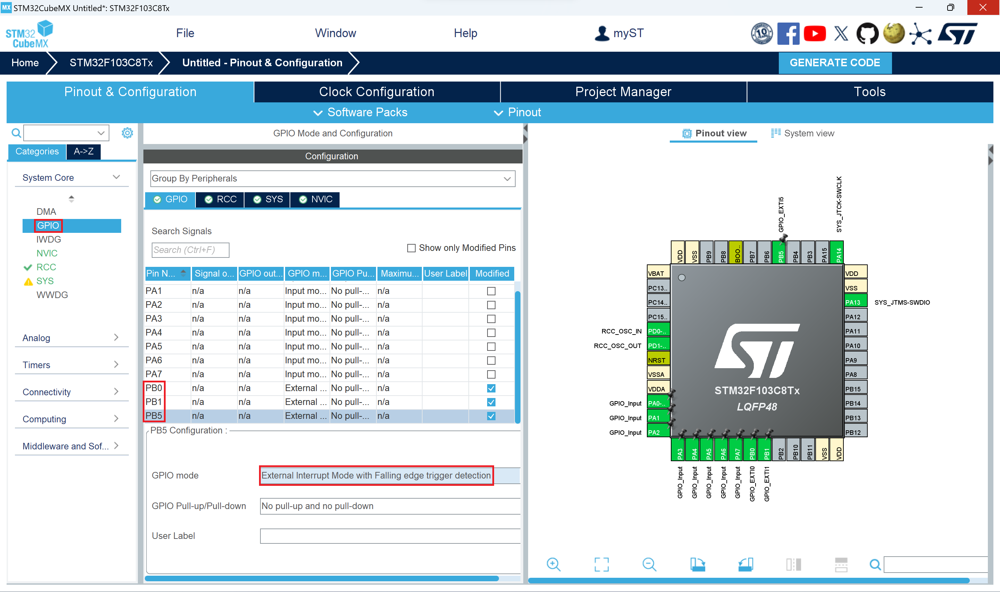

# Project 6: 利用外部中斷回報 USB 滑鼠的操作  
## STM32CubeMX  
在`System Core`中的`SYS`選項把`Debug`改成`Serial Wire`  

  
在`System Core`中的`RCC`選項把`High Speed Clock (HSE)`改成`Crystal/Ceramic Resonator`  

  
在`Pinout view`中完成下面三項操作  
1. 在`PB0`腳位上左鍵選擇`GPIO_EXTI0`  
2. 在`PB1`腳位上左鍵選擇`GPIO_EXTI1`  
3. 在`PB5`腳位上左鍵選擇`GPIO_EXTI5`  
  

  
在`Pinout view`中完成下面八項操作  
1. 在`PA0`腳位上左鍵選擇`GPIO_Input`  
2. 在`PA1`腳位上左鍵選擇`GPIO_Input` 
3. 在`PA2`腳位上左鍵選擇`GPIO_Input`  
4. 在`PA3`腳位上左鍵選擇`GPIO_Input` 
5. 在`PA4`腳位上左鍵選擇`GPIO_Input`  
6. 在`PA5`腳位上左鍵選擇`GPIO_Input` 
7. 在`PA6`腳位上左鍵選擇`GPIO_Input`  
8. 在`PA7`腳位上左鍵選擇`GPIO_Input` 
  

  
點擊`System Core`中的`GPIO`選項  
1. 把`PB0`的 GPIO mode 改為`External Interrupt Mode with Falling edge trigger detection`  
2. 把`PB1`的 GPIO mode 改為`External Interrupt Mode with Falling edge trigger detection`  
3. 把`PB5`的 GPIO mode 改為`External Interrupt Mode with Falling edge trigger detection`  
  

  
點擊`NVIC`選項  
1. 將`EXTI line0 interrupt`的 Enabled 打勾  
2. 將`EXTI line1 interrupt`的 Enabled 打勾  
3. 將`EXTI line[9:5] interrupts`的 Enabled 打勾  
  

  
在`Connectivity`中的`USB_DEVICE`選項把`Device (FS)`打勾  

  
在`Middleware and S....`中的`USB`選項把`Class For FS IP`改成`Human Interface Device Class (HID)`  

  
點擊`Clock Configuration`選項，出現`Do you want to run automatic clock issues solver ?`訊息選`Yes`  

  
等待一段時間完成時鐘的配置  

  
開啟`Project Manager`，自訂`Project Name`和`Project Location`並將`Toolchain / IDE`選擇`MDK-ARM`  

  
開啟`Code Generator`，選擇`Copy only the necessary library files`  

  
開啟`GENERATE CODE`等待程式碼完成，按`Open Project`使用`Keil µVision5`開啟專案  

  
此時`STM32CubeMX`應用程式使用完畢可以關閉程式  