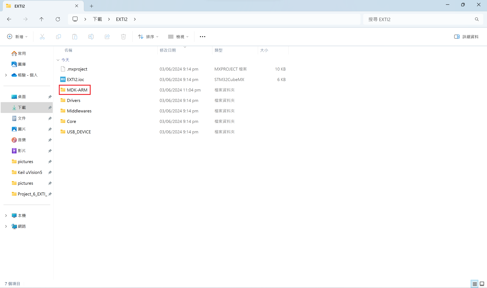
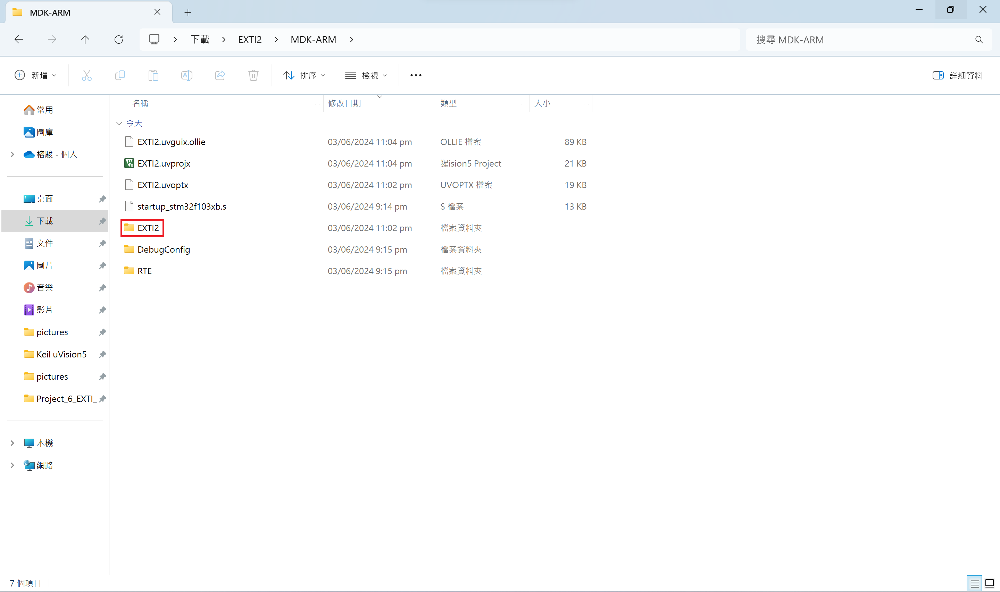
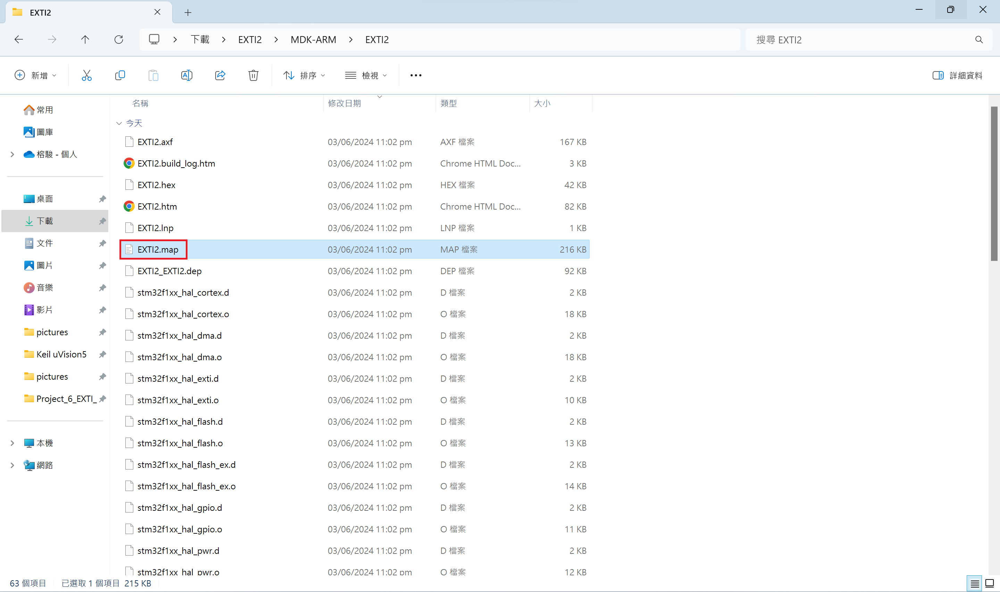

# Project 7: 編譯出來的程式大小  
參考[這篇文章](https://shatang.github.io/2020/08/22/Stm32%E7%9A%84%E5%86%85%E5%AD%98%E7%AE%A1%E7%90%86-Code-RO-data-RW-data-ZI-data/)  
  
## .map 文件位置  
開啟`MDK-ARM`資料夾  

  
開啟`EXTI2`資料夾  
***預設應該是跟 .uvprojx 檔名相同***  

  
點擊`EXTI2.map`文件  
***預設應該是跟 .uvprojx 檔名相同***  

  
## .map 文件位置  
引用[Stm32的内存管理(Code,RO-data,RW-data,ZI-data)](https://shatang.github.io/2020/08/22/Stm32%E7%9A%84%E5%86%85%E5%AD%98%E7%AE%A1%E7%90%86-Code-RO-data-RW-data-ZI-data/)的說明  
  
此文件說明各個函數占用的尺寸和地址，最後幾行內容如下:  
```text
Total RO  Size (Code + RO Data)                14956 (  14.61kB)
Total RW  Size (RW Data + ZI Data)              4000 (   3.91kB)
Total ROM Size (Code + RO Data + RW Data)      15172 (  14.82kB)
```
  
1. RO Size = (Code + RO-data)：表示程序占用 Flash 空間的大小  
2. RW Size = (RW-data + ZI-data)：表示運行時占用的 RAM 的大小  
3. ROM Size = (Code + RO Data + RW Data)：表示燒寫程序所占用的 Flash 空間的大小  