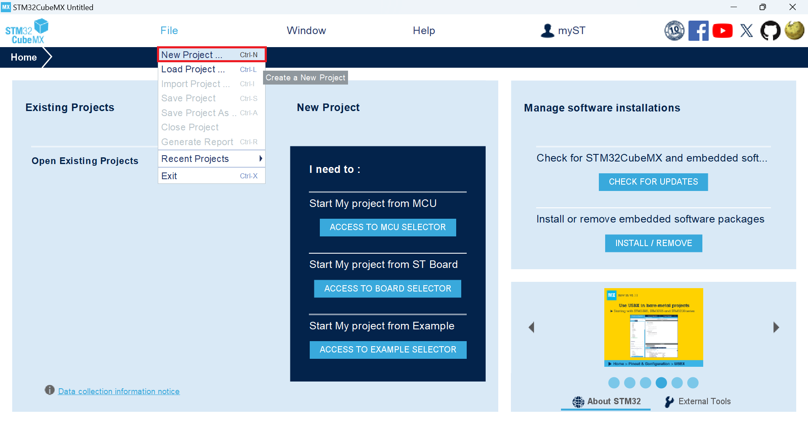
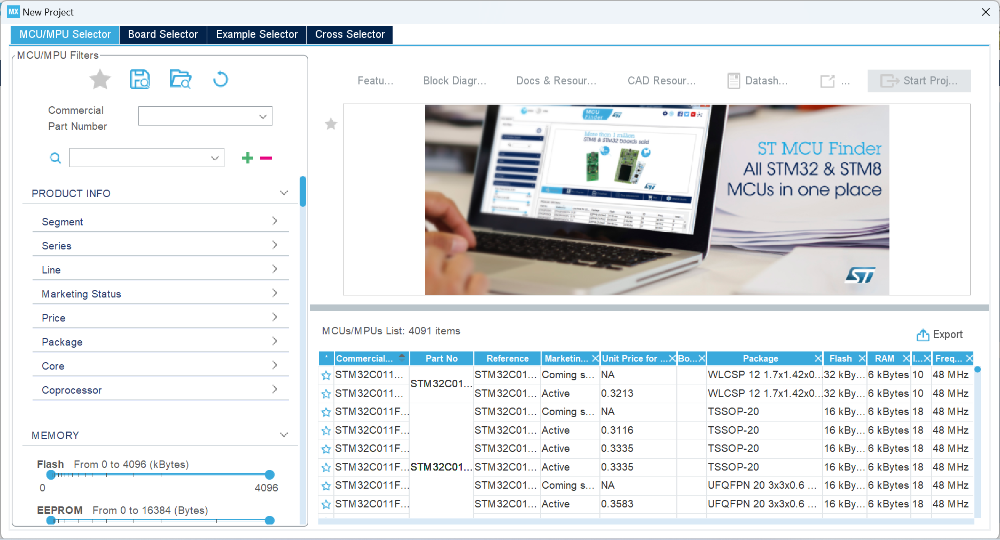
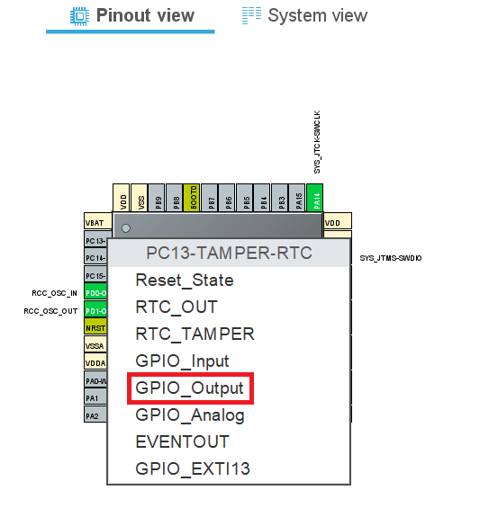

# Project 1: 點亮 PC13 的 LED 燈    
此專案將把`STM32F103C8T6`的`PC13`的 LED 燈點亮  
  
## STM32CubeMX  
開啟`STM32CubeMX`點擊`New Project`  

  
出現`Error during Data Refresh`報錯  

  
等待一段時間會跳出此頁面  

  
在 Commercial Part Number 輸入`stm32f103c8t6`並在右邊選擇`stm32f103c8t6`選項  

  
點擊右上角的 Start Project  

  
會出現下圖  

  
展開`System Core`之中的`SYS`選擇`Serial Wire`選項

  
將`System Core`之中的`RCC`的 High Speed Clock 選擇`Crystal/Ceramic Resonator`選項

  
Pinout view 中在`PC13`腳位上左鍵選擇`GPIO_Output`
