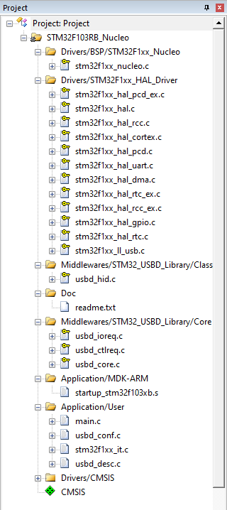

# 利用 STM32 模擬 USB 滑鼠  
利用官方的 STM32F103RB-Nucleo 倉庫範例改寫  
所需要的程式東西如下  
  
  
## int main(void) 程式  
跟滑鼠有關部分如下
```c
GetPointerData(HID_Buffer);
USBD_HID_SendReport(&USBD_Device, HID_Buffer, 4);
```
  
其中`USBD_Device`和`HID_Buffer`的定義為
```c
/* Private variables ---------------------------------------------------------*/
USBD_HandleTypeDef USBD_Device;
uint8_t HID_Buffer[4];
```
  
## USBD_HID_SendReport 程式  
位於`\Middlewares\ST\STM32_USB_Device_Library\Class\HID\Src\usbd_hid.c`中  
  
此函數能夠發送滑鼠的動作  
```c
/**
  * @brief  USBD_HID_SendReport
  *         Send HID Report
  * @param  pdev: device instance
  * @param  buff: pointer to report
  * @retval status
  */
uint8_t USBD_HID_SendReport(USBD_HandleTypeDef  *pdev,
                            uint8_t *report,
                            uint16_t len)
{
  USBD_HID_HandleTypeDef     *hhid = (USBD_HID_HandleTypeDef *)pdev->pClassData;

  if (pdev->dev_state == USBD_STATE_CONFIGURED)
  {
    if (hhid->state == HID_IDLE)
    {
      hhid->state = HID_BUSY;
      USBD_LL_Transmit(pdev,
                       HID_EPIN_ADDR,
                       report,
                       len);
    }
  }
  return USBD_OK;
}
```
  
`USBD_LL_Transmit`位於`Middlewares\ST\STM32_USB_Device_Library\Core\Src`中的`usbd_conf_template.c`  
```c
/**
  * @brief  Transmits data over an endpoint.
  * @param  pdev: Device handle
  * @param  ep_addr: Endpoint Number
  * @param  pbuf: Pointer to data to be sent
  * @param  size: Data size
  * @retval USBD Status
  */
USBD_StatusTypeDef USBD_LL_Transmit(USBD_HandleTypeDef *pdev, uint8_t ep_addr,
                                    uint8_t *pbuf, uint16_t size)
{
  return USBD_OK;
}
```
  
## GetPointerData 程式  
位於`Projects/STM32F103RB-Nucleo/Applications/USB_Device/HID_Standalone/Src/main.c`中  
  
滑鼠位移的大小可以改變第32行`CURSOR_STEP`來達成  
```c
#define CURSOR_STEP     5
```
  
此程式每呼叫一次變數`cnt`會加一  
因此滑鼠會先向右移動再往左移  
想要垂直移動可以新增變數`y`的程式部分  
```c
/**
  * @brief  Gets Pointer Data.
  * @param  pbuf: Pointer to report
  * @retval None
  */
static void GetPointerData(uint8_t *pbuf)
{
  static int8_t cnt = 0;
  int8_t  x = 0, y = 0 ;
  
  if(cnt++ > 0)
  {
    x = CURSOR_STEP;
  }
  else
  {
    x = -CURSOR_STEP;
  }
  
  pbuf[0] = 0;
  pbuf[1] = x;
  pbuf[2] = y;
  pbuf[3] = 0;
}
```