# Keil µVision5  
Google 搜尋`keil mdk-arm`點擊第一個[網站](https://www.arm.com/zh-TW/products/development-tools/embedded-and-software/keil-mdk)

  
下滑網頁選擇`Keil MDK-Community`版本點擊`開始使用`
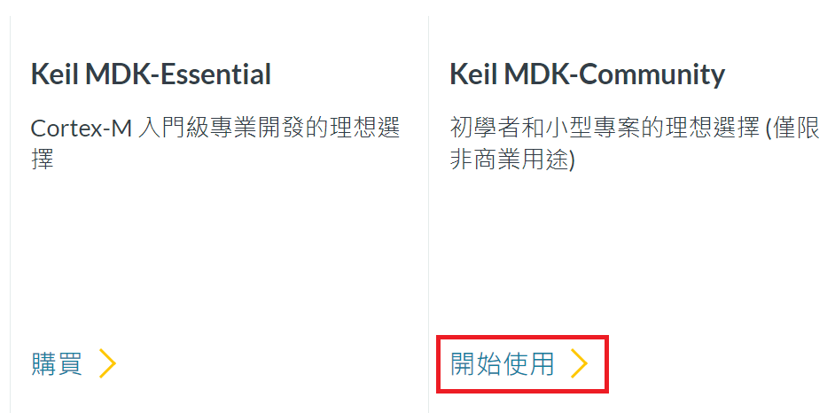
  
點擊`Download µVision`
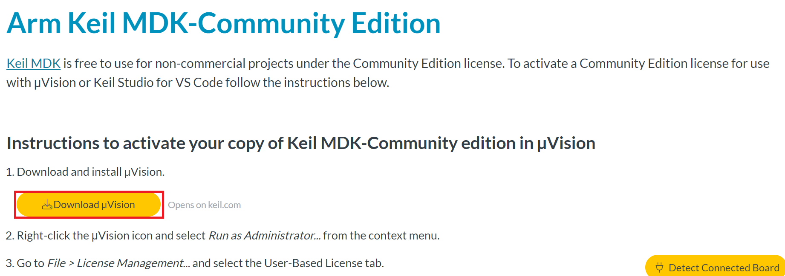
  
會跳轉至[此網站](https://www.keil.com/demo/eval/arm.htm)填寫訊息後按`Submit`  
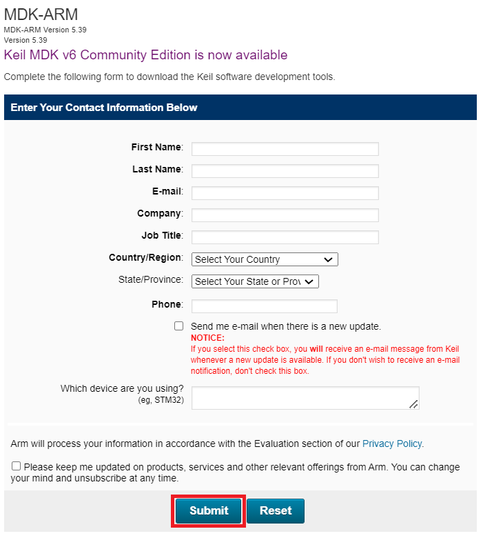
  
點擊`MDK539.EXE`進行下載  
**此檔案大約有913 MB 註: 2024年4月10日**  
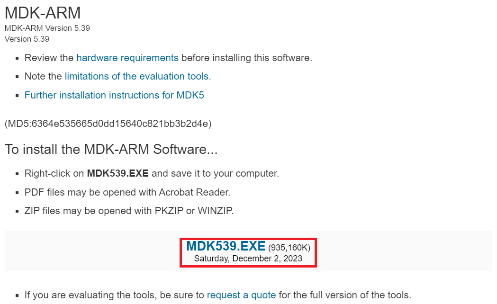
  
執行`MDK539.EXE`  

  
預設 Core 位於 `C:\Keil_v5`
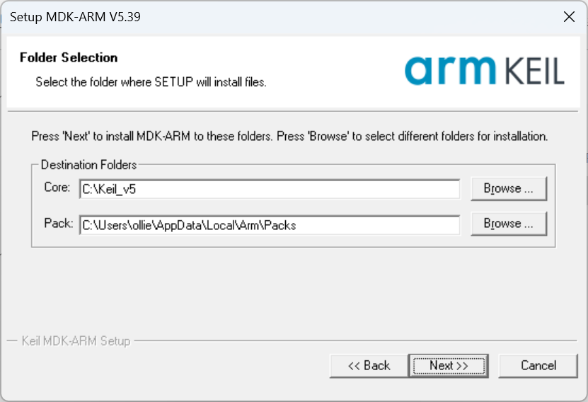
  
填寫資料  
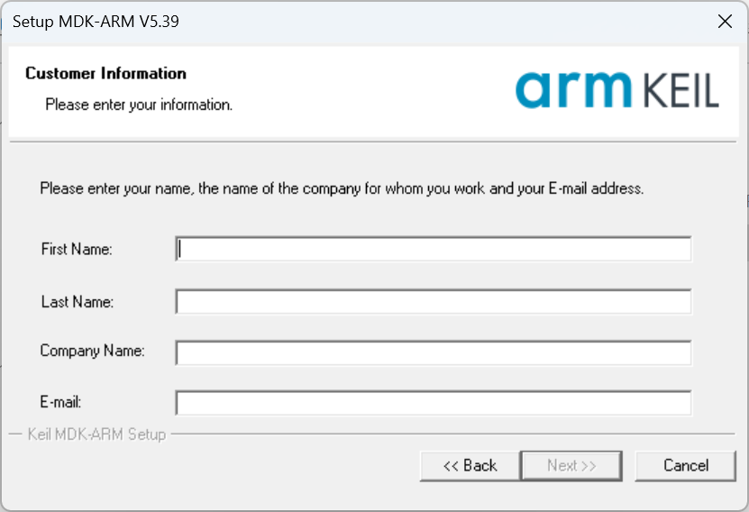
  
安裝`KEIL - Tools By ARM 通用序列匯流排控制器`  
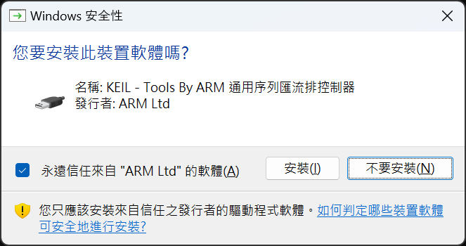
  
安裝完成  
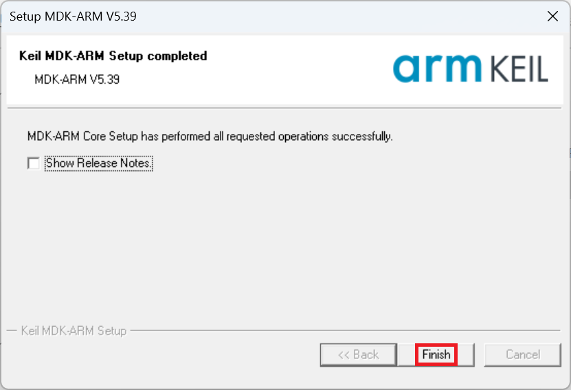
  
啟動`Keil µVision5`  
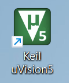
  
會跳出`Pack Installer`按`OK`  
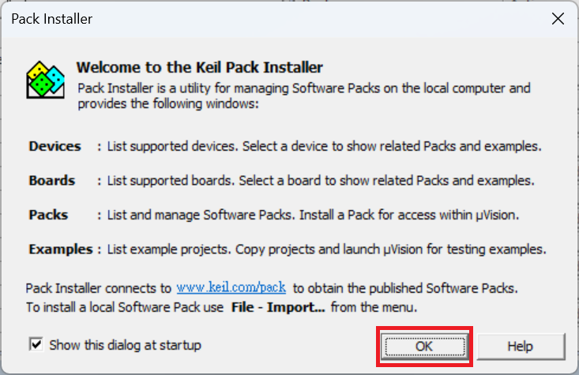
  
`Pack Installer`頁面如下  
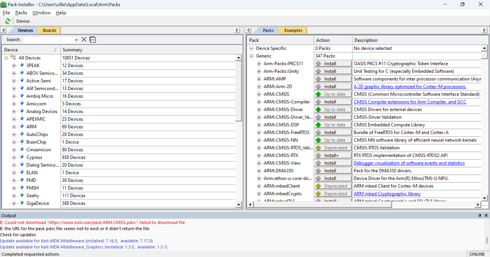