# STM32 軟體安裝  
## STM32 ST-LINK utility 安裝  
Google 搜尋 [stm32 link 官網](https://www.st.com/en/development-tools/stsw-link004.html)
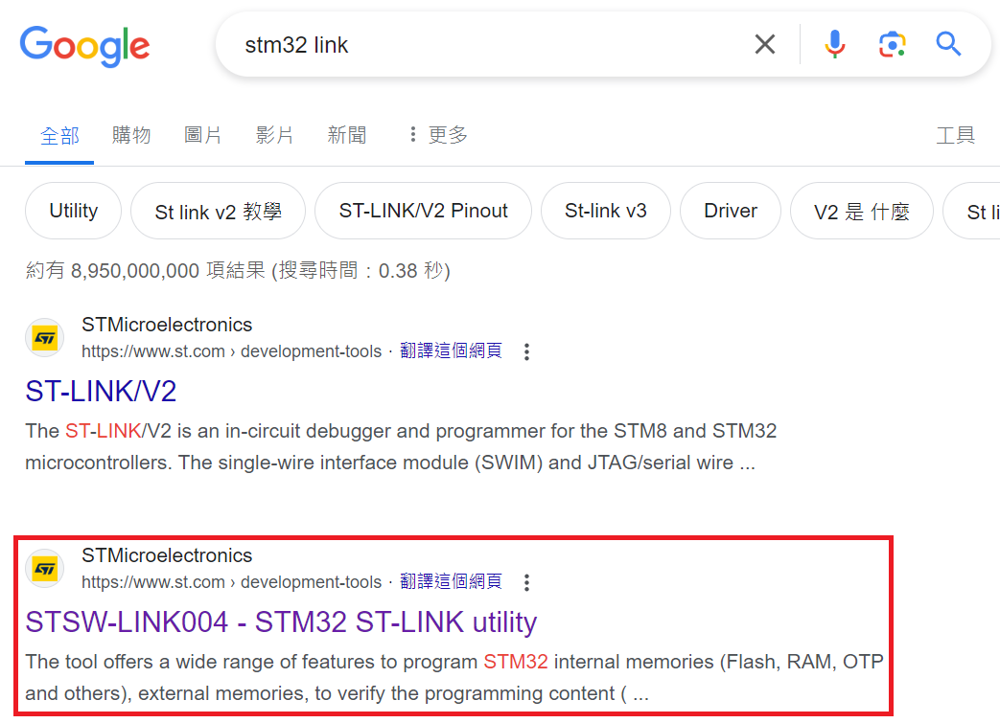  
  
下滑網頁點擊`Getlatest`
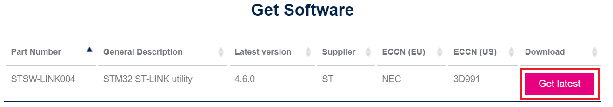
  
下滑說明書點擊`Accept`

  
登入帳號或訪客下載壓縮檔`en.stsw-link004.zip`

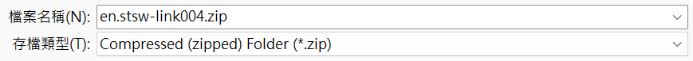
  
解壓縮`en.stsw-link004.zip`並執行`setup.exe`
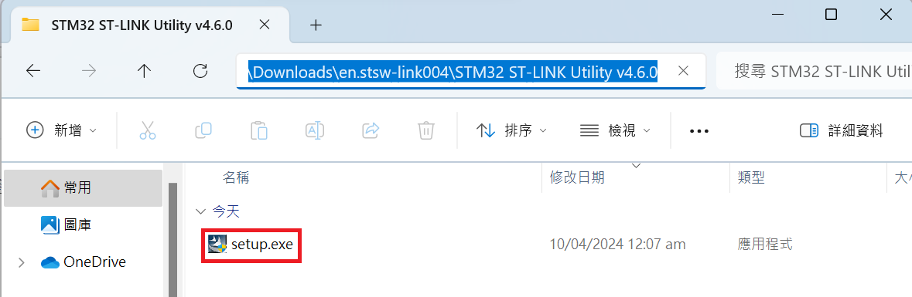
  
執行`setup.exe`的內容完成安裝
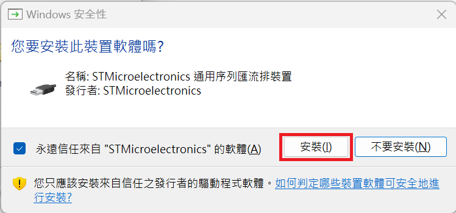
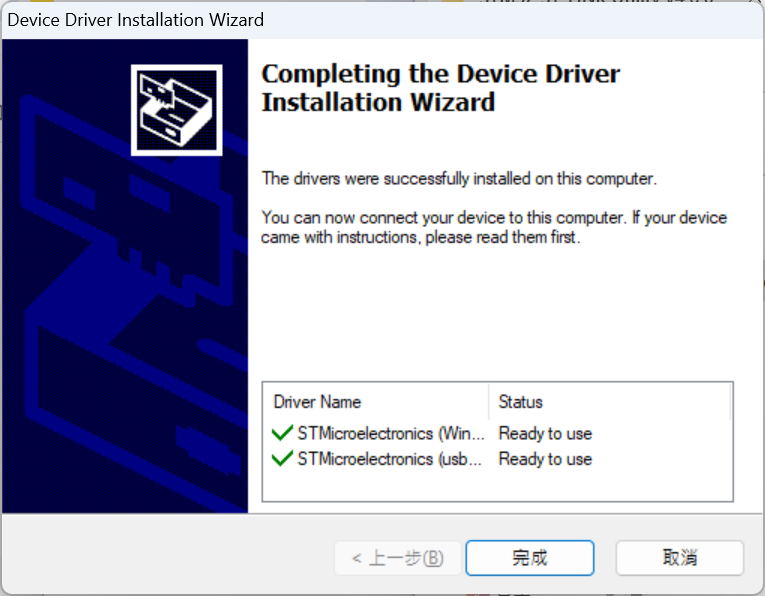
  
## 執行 STM32 ST-LINK utility  
執行`STM32 ST-LINK utility`  
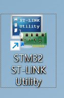
  
開啟後初始頁面如下，點擊紅框的`Connect`選項
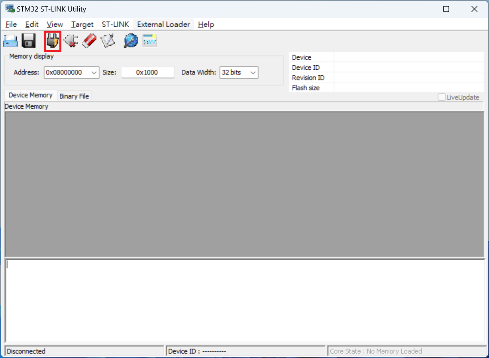
  
如果連接正確頁面會如圖下所示
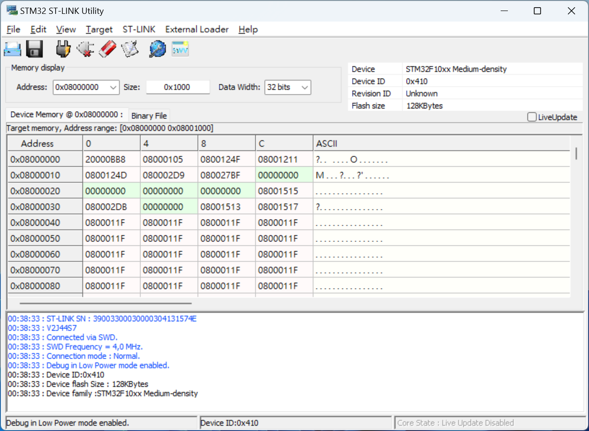
  
## STM32 ST-LINK utility dll 缺失  
執行`STM32 ST-LINK Utility`出現缺少`mfc140.dll`、`VCRUNTIME140.dll`和`MSVCP140.dll`的缺失
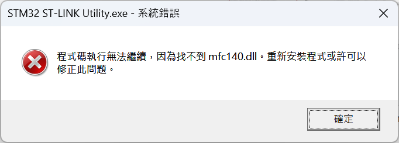
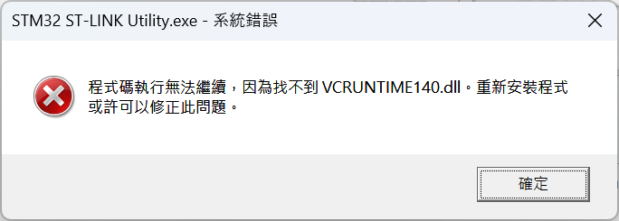
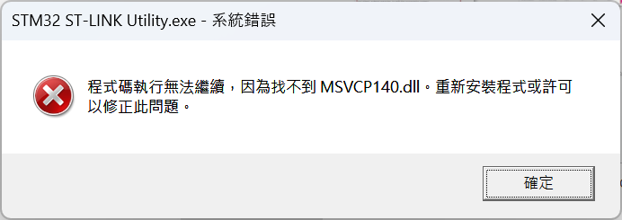
  
參考[這篇文章](https://community.st.com/t5/stm32-mcus-boards-and-hardware/i-downloaded-the-application-stsw-link004-stm-32-st-link-utility/td-p/180989)提供的解法  
  
Google 搜尋 Microsoft Visual C++ 2015 [官網](https://www.microsoft.com/zh-tw/download/details.aspx?id=48145)

  
下滑網站點擊`下載`
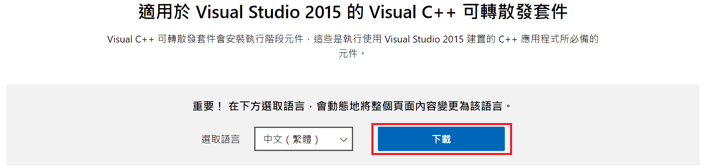
  
選擇`vc_redist.x64.exe`選項按下載
**後來發現`vc_redist.x86.exe`也需要同時下載**
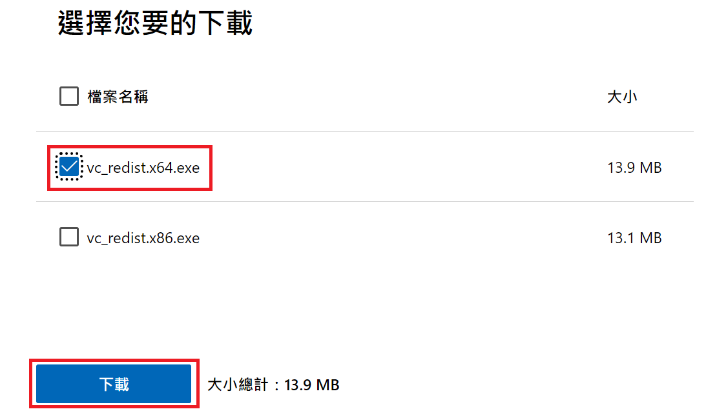
  
執行`vc_redist.x64.exe`完成`Microsoft Visual C++ 2015`的安裝
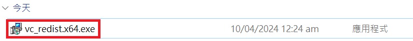
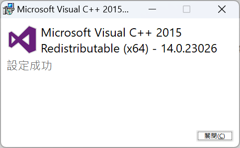
  
## STM32CubeMX 安裝  
Google 搜尋`STM32CubeMX`的[官網](https://www.st.com/en/development-tools/stm32cubemx.html)
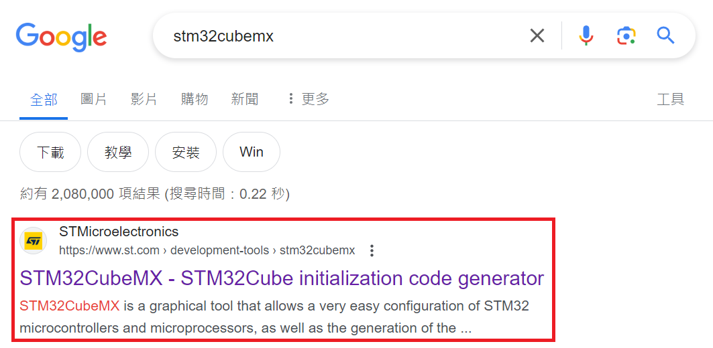
  
下滑網頁選擇 Windows 版本點擊`Getlatest`
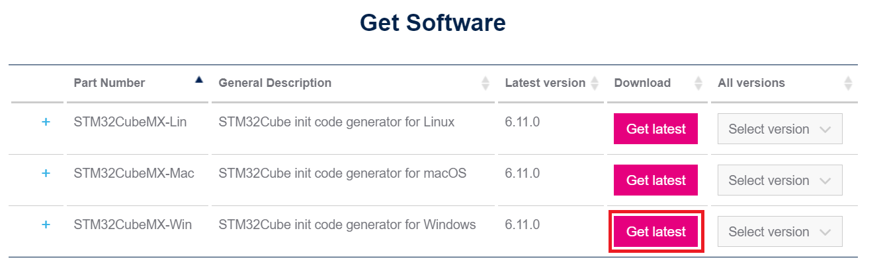
  
下滑說明書點擊`Accept`

  
登入帳號或訪客下載壓縮檔`en.stm32cubemx-win-v6-11-0.zip`

  
解壓縮`en.stm32cubemx-win-v6-11-0.zip`並執行`SetupSTM32CubeMX-6.11.0-Win.exe`進行安裝

  
## KEIL  
Google 搜尋`keil mdk-arm`點擊第一個[網站](https://www.arm.com/zh-TW/products/development-tools/embedded-and-software/keil-mdk)
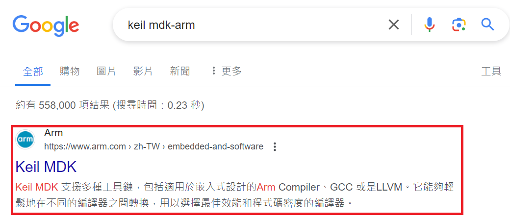
  
