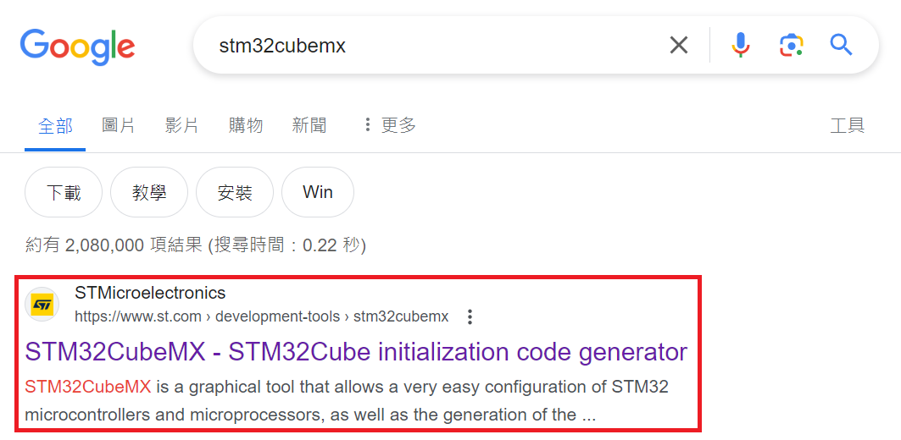
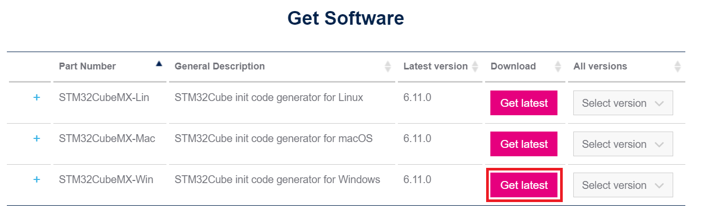
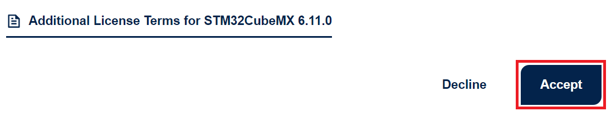
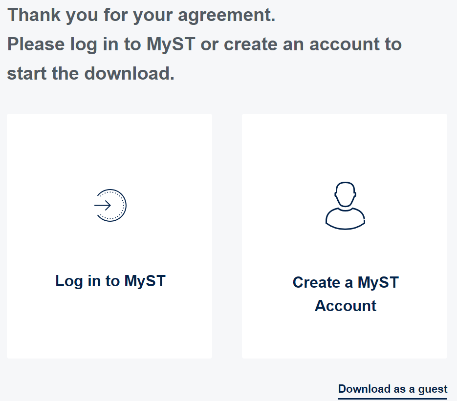
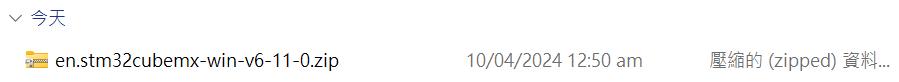
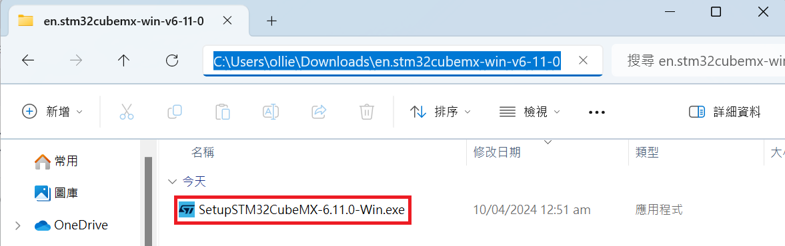
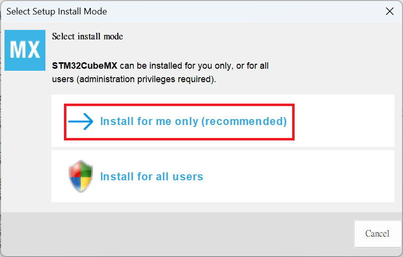
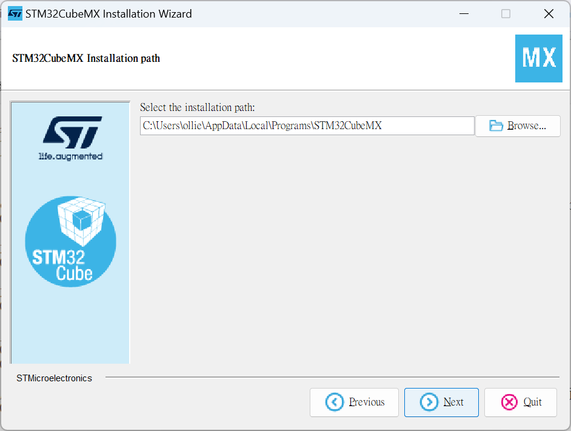
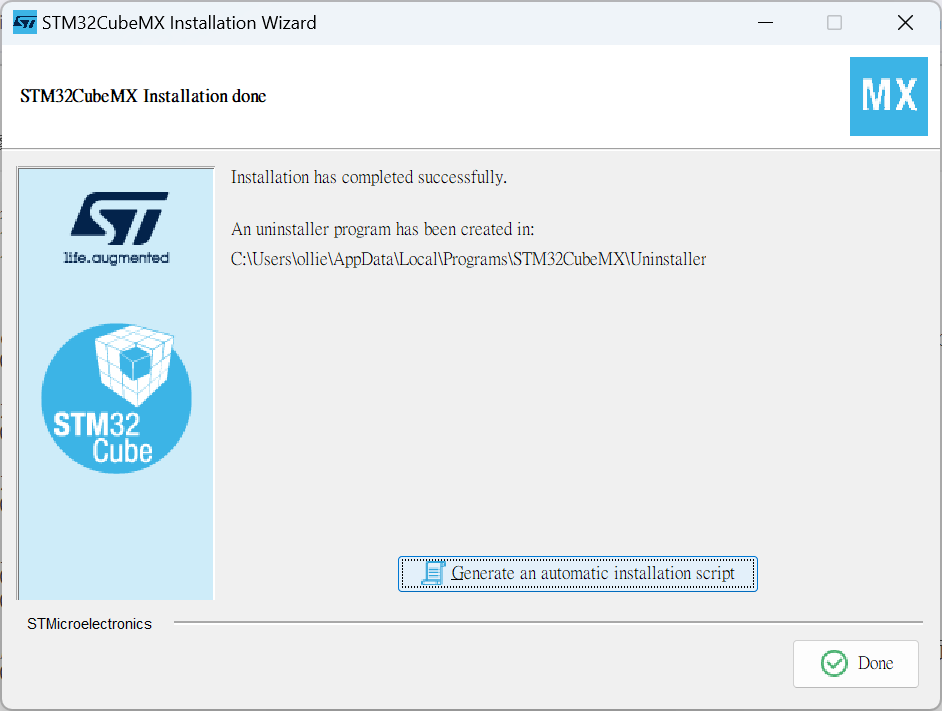

# STM32CubeMX 安裝  
Google 搜尋`STM32CubeMX`的[官網](https://www.st.com/en/development-tools/stm32cubemx.html)

  
下滑網頁選擇 Windows 版本點擊`Get latest`

  
下滑說明書點擊`Accept`

  
登入帳號或訪客選項

  
下載壓縮檔`en.stm32cubemx-win-v6-11-0.zip`

  
解壓縮`en.stm32cubemx-win-v6-11-0.zip`並執行`SetupSTM32CubeMX-6.11.0-Win.exe`進行安裝

  
選擇`Install for me only (recommended)`

  
預設安裝路徑於`C:\Users\使用者名\AppData\Local\Programs\STM32CubeMX'

  
等待安裝完成
